# Chat Transfer for Threema – Anleitung

> **Beta (0.9.0-beta.1).** Auf einem echten iPhone nachgewiesen (iOS 27.0, 24A437): der Wiederherstellungs-Mechanismus
> (eine Test-Wiederherstellung, die nichts verändert) und der ganze Ablauf der App bis zur Übertragung, bei der das
> iPhone selbst abgelehnt hat, weil „Wo ist?“ noch an war – verändert wurde nichts. Noch nicht nachgewiesen: eine
> Übertragung, die die App selbst bis zum Ende ausführt. Wenn Sie jeden Tag auf Ihr iPhone angewiesen sind oder keine
> frische Apple-Sicherung haben, warten Sie bitte auf eine spätere Version. Die App-Bilder stammen aus dem Demo-Modus.

Chat Transfer for Threema ist **inoffiziell**: Es stammt nicht von der Threema AG, und der Threema-Support kann dabei
nicht helfen. Mit **†** markierte Menüpfade sind noch nicht in beiden Sprachen am Gerät gegengelesen; der Wortlaut auf
Ihrem iPhone oder Android-Handy kann leicht abweichen.

English: [../en/README.md](../en/README.md)

## Inhalt

1. [Überblick](#1-überblick)
2. [Bevor Sie anfangen](#2-bevor-sie-anfangen)
3. [Installieren](#3-installieren)
4. [Schritt für Schritt](#4-schritt-für-schritt)
5. [Nach dem Umzug](#5-nach-dem-umzug)
6. [Wenn etwas schiefgeht](#6-wenn-etwas-schiefgeht)
7. [Häufige Fragen](#7-häufige-fragen)
8. [Datenschutz](#8-datenschutz)
9. [Deinstallieren](#9-deinstallieren)
10. [Für Fortgeschrittene](#10-für-fortgeschrittene)

---

## 1. Überblick

**Was Chat Transfer for Threema macht.** Chat Transfer for Threema überträgt Ihren Threema-Verlauf (Nachrichten, Bilder, Sprachnachrichten, Dateien
und Umfragen) aus einer Threema-Datensicherung von Android in Threema auf Ihrem iPhone. Ihr iPhone wird dabei
**nicht** gelöscht und nicht neu eingerichtet. Alles passiert auf Ihrem Mac, mit einem USB-Kabel zum iPhone. Ihre
Chats werden nicht ins Internet gesendet.

**So funktioniert es, in einem Absatz.** Sie erstellen in Threema auf dem Android-Handy eine Datensicherung und
kopieren sie auf den Mac. Threema auf dem iPhone richten Sie wie gewohnt mit Threema Safe ein. Chat Transfer for Threema macht dann
eine Sicherung des iPhones, fügt Ihren alten Verlauf in eine Kopie der Threema-Daten des iPhones ein, prüft alles
doppelt und spielt das Ergebnis in einer einzigen Wiederherstellung auf das iPhone zurück. Nach dem Neustart des
iPhones macht Chat Transfer for Threema eine zweite Sicherung und vergleicht sie mit der ersten. So ist sicher, dass sich außer Threema
nichts verändert hat.

**Was Chat Transfer for Threema nicht macht.**

- Es stammt **nicht** von Threema oder Apple, und beide bieten dafür keinen Support. Es ist ein inoffizielles,
  kostenloses Open-Source-Werkzeug.
- Es überträgt nicht Ihre Threema-ID, Kontakte oder Einstellungen. Das erledigt Threema Safe, und das benutzen Sie
  selbst auf dem iPhone.
- Es funktioniert nicht mit Threema Work oder Threema OnPrem, nicht mit iPhones, die eine Firma oder Schule verwaltet,
  nicht auf Intel-Macs oder Windows und nicht in die andere Richtung (iPhone zu Android).
- Es führt keine zwei verschiedenen Threema-IDs zusammen. Android-Sicherung und iPhone müssen dieselbe Threema-ID haben.
- Es überträgt nichts auf einer iOS-Version, die es nicht geprüft hat. Dann hält es an, bevor am iPhone etwas
  verändert wird.
- Es ersetzt keine Apple-Sicherung. Die legen Sie unterwegs selbst an, als Sicherheitsnetz.
- Es verbindet sich nicht mit dem Internet, braucht kein Konto, sammelt keine Nutzungsdaten und aktualisiert sich nicht
  selbst.

**Was sich am iPhone verändert.** Bei der Wiederherstellung setzt das iPhone einige Bereiche auf den Stand von wenigen
Minuten vorher zurück: Einstellungen, Mitteilungen, lokale Fotos, SMS/iMessage, Anrufliste, Wallet-Pässe und
Tastatur. Was Sie in dieser Zeit am iPhone tun, geht verloren. Deshalb bleibt das iPhone im Flugmodus und unbenutzt.
Danach melden Sie sich mit Ihrem Apple Account neu an und fügen Karten in Apple Pay neu hinzu. Mails, die nur „Auf
meinem iPhone“ liegen (POP, lokale Ordner), können verloren gehen. Ihre anderen Apps und gespeicherten Passwörter
bleiben unverändert.

## 2. Bevor Sie anfangen

### Was Sie brauchen

| | |
|---|---|
| Mac | Mac mit Apple-Chip (M1 oder neuer), macOS 14 oder neuer, am Netzteil |
| Speicher am Mac | Platz für zwei Sicherungen Ihres iPhones plus die entpackte Android-Sicherung; die App nennt Ihnen den genauen Wert |
| iPhone | eine iOS-Version, die Chat Transfer for Threema geprüft hat (die App prüft das zuerst, nur lesend) |
| Threema | die normale Threema-App aus dem App Store auf dem iPhone; das Android-Handy mit Threema |
| Kabel | ein USB-Kabel zwischen iPhone und Mac (keine WLAN-Synchronisierung) |
| Passwörter | Ihr Threema-Safe-Passwort, der Code Ihres iPhones, das Passwort Ihres Apple Accounts, das Passwort der Android-Datensicherung und, falls schon eines eingeschaltet ist, das Passwort für iPhone-Sicherungen ([was das ist](#das-passwort-für-iphone-sicherungen)) |
| Apple-Sicherung | Platz in iCloud für ein iCloud-Backup oder Platz auf dem Mac für eine Finder-Sicherung |
| Zeit | etwa 1½ bis 3 Stunden. Davon ist Ihr iPhone 30 bis 60 Minuten offline und darf nicht benutzt werden |

### Grenzen von Version 1

- Lokale Fotos auf dem iPhone: höchstens 20 GB. Mit „iPhone-Speicher optimieren“ in iCloud-Fotos ist der lokale Teil
  meist viel kleiner †.
- Threema: nur die normale App (kein Threema Work, kein OnPrem). Chat Transfer for Threema schreibt nur in ein Threema-Datenmodell, das
  es genau kennt. Ändert ein Threema-Update das Datenmodell, wartet es auf ein Update von Chat Transfer for Threema.
- iOS: nur geprüfte Versionen. Neue iOS-Versionen prüfen wir meist innerhalb von zwei Wochen. Installieren Sie keine
  iOS-Updates, solange Sie den Umzug planen.
- Android-Sicherungen: nur das geprüfte Sicherungsformat. Eine Sicherung aus einer neueren Threema-Version für Android
  wird mit einer klaren Meldung abgelehnt.
- iPhones, die eine Firma oder Schule verwaltet, werden nicht unterstützt.

### Gut zu wissen

- **Android-Sicherung spät erstellen.** Nachrichten, die nach der Sicherung auf dem Android-Handy ankommen, fehlen
  sonst. Am besten direkt bevor Sie Threema auf dem iPhone einrichten.
- **Personen, die nicht in Ihren Kontakten sind.** Stammen alte Gruppennachrichten von Personen, die nie in Ihren
  Threema-Kontakten waren, zeigt Chat Transfer for Threema Ihnen deren Threema-IDs. Fügen Sie diese Personen vor der Übertragung in
  Threema auf dem iPhone als Kontakt hinzu, sonst fehlen diese Nachrichten.
- **„Wo ist?“.** Für die Übertragung schalten Sie „Mein iPhone suchen“ aus. Ist der „Schutz für gestohlene Geräte“ an,
  verzögert das iPhone diesen Schritt unterwegs um eine Stunde. Machen Sie das zu Hause.

### Das Passwort für iPhone-Sicherungen

Chat Transfer for Threema arbeitet mit Sicherungen Ihres iPhones auf diesem Mac. Diese Sicherungen müssen verschlüsselt sein, denn nur
dann enthalten sie alle Daten. Dafür gibt es das **Passwort für iPhone-Sicherungen auf dem Mac**:

- Es ist ein eigenes Passwort nur für Sicherungen Ihres iPhones auf einem Computer.
- Es ist **nicht** der Code, mit dem Sie Ihr iPhone entsperren.
- Es ist **nicht** das Passwort Ihres Apple Accounts.
- Es hat **nichts** mit iCloud-Backups zu tun. iCloud-Backups fragen nie danach. Auch wenn Sie bisher nur
  iCloud-Backups gemacht haben, kann es auf Ihrem iPhone trotzdem eingeschaltet sein (Fall 2).

Die Einstellung gehört zum iPhone, nicht zum Mac. Chat Transfer for Threema liest selbst aus, welcher Fall bei Ihnen gilt, und zeigt
den passenden Bildschirm.

**Fall 1: Es ist noch kein Passwort eingeschaltet.** Das ist der häufigste Fall. Chat Transfer for Threema erzeugt ein Passwort für
Sie (sechs Gruppen zu je vier Zeichen), oder Sie wählen ein eigenes (mindestens 10 Zeichen). Schreiben Sie es auf; zur
Kontrolle tippen Sie die letzten vier Zeichen ein. Standardmäßig sichert Chat Transfer for Threema es zusätzlich im Schlüsselbund
dieses Mac („Chat Transfer for Threema – Backup-Passwort“). Dann klicken Sie auf „Verschlüsselung einschalten“:

- Das iPhone fragt zur Bestätigung nach seinem Code. Geben Sie ihn am iPhone ein.
- Auf dem iPhone wird nichts gelöscht.
- Die Einstellung bleibt danach an. Künftige Sicherungen auf einem Computer verwenden dieses Passwort, und Sie brauchen
  es, um später eine solche Sicherung zurückzuspielen.

**Fall 2: Es ist schon ein Passwort eingeschaltet.** Dann verschlüsselt Ihr iPhone jede Sicherung auf einem Computer
mit diesem gespeicherten Passwort, und Chat Transfer for Threema kann die Sicherung nur mit genau diesem Passwort öffnen.
**Ein neues oder beliebiges Passwort funktioniert hier nicht.** Die App fragt deshalb: „Kennen Sie dieses Passwort?“

- **Ich kenne das Passwort:** Geben Sie es ein. Die App prüft es gleich nach der ersten Sicherung. Ist es falsch, sagt
  sie Ihnen das nach wenigen Minuten; am iPhone wird dabei nichts verändert, und für einen neuen Versuch ist keine neue
  Sicherung nötig.
- **Ich weiß es nicht / habe nie eins festgelegt:** Das kommt oft vor. Meist wurde das Passwort vor Jahren in iTunes
  oder im Finder („Lokales Backup verschlüsseln“) oder mit einem anderen iPhone-Programm festgelegt; die Einstellung
  kann beim Wechsel auf ein neues iPhone mitkommen, auch über ein iCloud-Backup. Die App zeigt dann diese Schritte:

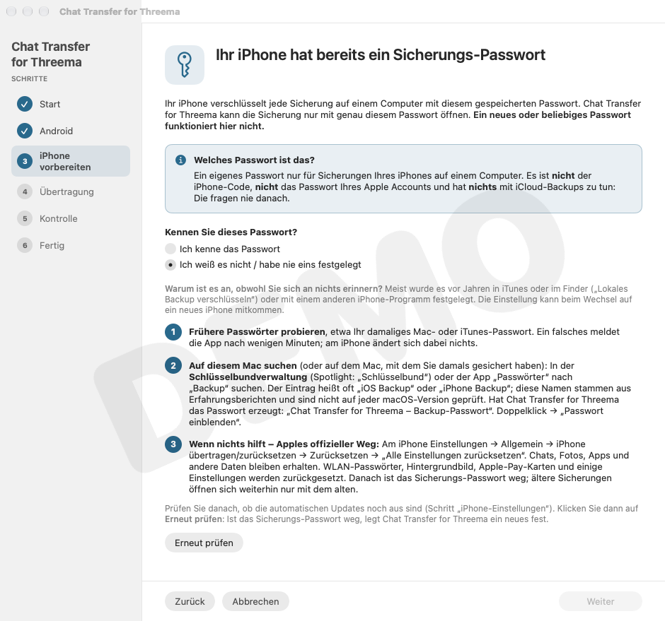

1. **Frühere Passwörter probieren**, etwa Ihr damaliges Mac- oder iTunes-Passwort.
2. **Auf diesem Mac suchen** (oder auf dem Mac, mit dem Sie damals gesichert haben): **Schlüsselbundverwaltung**
   öffnen (Spotlight, ⌘-Leertaste → „Schlüsselbund“; die App „Passwörter“ zeigt solche Einträge möglicherweise nicht †)
   und oben rechts nach „Backup“ suchen (sonst nach „iPhone“ oder „iOS“). Der Eintrag heißt meist „iOS Backup“ oder
   „iPhone Backup“ †; hat Chat Transfer for Threema das Passwort erzeugt, „Chat Transfer for Threema – Backup-Passwort“.
   Doppelklick → „Passwort einblenden“ → mit Ihrem Mac-Passwort bestätigen. Die Namen „iOS Backup“ und „iPhone Backup“
   stammen aus Erfahrungsberichten; wir haben sie nicht auf jeder macOS-Version geprüft.
3. **Wenn nichts hilft: Apples offizieller Weg.** Am iPhone Einstellungen → Allgemein → iPhone übertragen/zurücksetzen
   → Zurücksetzen → „Alle Einstellungen zurücksetzen“ †. Chats, Fotos, Apps und andere Daten bleiben erhalten;
   WLAN-Passwörter, Hintergrundbild, Apple-Pay-Karten und einige Einstellungen werden zurückgesetzt. Danach ist das
   Sicherungs-Passwort weg; ältere verschlüsselte Sicherungen öffnen sich weiterhin nur mit dem alten Passwort. Prüfen
   Sie, ob die automatischen Updates noch aus sind, und klicken Sie in der App auf **Erneut prüfen**: Sie liest das
   iPhone neu und legt wie in Fall 1 ein neues Passwort fest. War Ihr Sicherheitsnetz eine Finder-Sicherung, ist sie
   mit dem alten Passwort verschlüsselt; machen Sie dann zusätzlich ein iCloud-Backup.

Dieselbe Hilfe öffnet der Bildschirm „Passwort für iPhone-Sicherungen falsch“ mit „Passwort unbekannt? So kommen Sie
weiter“.

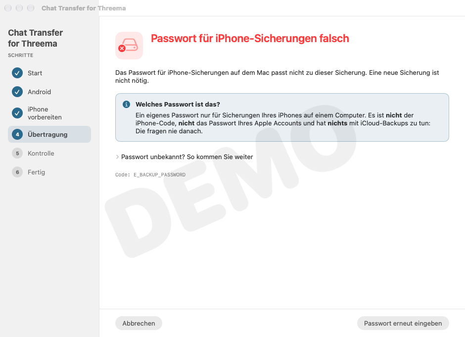

## 3. Installieren

Chat Transfer for Threema ist kostenlos und nicht bei Apple registriert (das kostet 99 USD pro Jahr). macOS kann den Hersteller
deshalb nicht bestätigen und fragt Sie einmal, ob Sie die App zulassen. Der Quellcode liegt offen, und jede Version hat
eine Prüfsumme.

**Download:** Es gibt noch keine Veröffentlichung. Versionen erscheinen auf der Seite *Releases* des Projekts als
`threema-chat-transfer-X.Y.Z.dmg` mit einer Datei `SHA256SUMS`.

### Chat Transfer for Threema zum ersten Mal öffnen („Trotzdem öffnen“)

1. Öffnen Sie `threema-chat-transfer-X.Y.Z.dmg` und ziehen Sie Chat Transfer for Threema in den Ordner „Programme“. Starten Sie Chat Transfer for Threema nicht direkt
   aus dem DMG.

   <!-- screenshot planned: ../../images/gatekeeper/de/macos27-step1.png -->

2. Öffnen Sie Chat Transfer for Threema in „Programme“. macOS meldet *„Chat Transfer for Threema“ wurde nicht geöffnet*. Klicken Sie auf **Fertig**
   (nicht „In den Papierkorb“).

   <!-- screenshot planned: ../../images/gatekeeper/de/macos27-step2.png -->

3. Öffnen Sie Systemeinstellungen → Datenschutz & Sicherheit und scrollen Sie nach unten zu „Sicherheit“. Bei
   *„Chat Transfer for Threema“ wurde blockiert …* klicken Sie auf **Trotzdem öffnen**.

   <!-- screenshot planned: ../../images/gatekeeper/de/macos27-step3.png -->

4. Bestätigen Sie mit **Trotzdem öffnen** und Ihrem Mac-Passwort oder Touch ID. Das ist nur beim ersten Start nötig.

   <!-- screenshot planned: ../../images/gatekeeper/de/macos27-step4.png -->

Unter macOS 14 geht zusätzlich der alte Weg: in „Programme“ mit der rechten Maustaste auf Chat Transfer for Threema → **Öffnen** →
**Öffnen**.

<!-- screenshot planned: ../../images/gatekeeper/de/macos14-rightclick-open.png -->

Unter macOS 15 und 26 sehen die Schritte gleich aus. Bilder für jede Version stehen in den Release-Notizen.

**Meldet macOS, die App „ist beschädigt“**, ist der Download kaputt. Löschen Sie ihn, laden Sie ihn erneut und
vergleichen Sie die Prüfsumme (Kapitel 10). Folgen Sie nie Anleitungen aus dem Internet, die Ihnen sagen, Befehle in
das Terminal zu kopieren, um eine App zu „reparieren“.

## 4. Schritt für Schritt

Die App führt Sie durch sechs Phasen, die links in der Seitenleiste stehen: **Start · Android · iPhone vorbereiten ·
Übertragung · Kontrolle · Fertig**. Bis die iPhone-Sicherung beginnt, können Sie frei zurückgehen. Ab „iPhone offline
schalten“ ist „Zurück“ gesperrt, weil die Zeit läuft. Bis Sie auf „Jetzt übertragen“ klicken, können Sie jederzeit
abbrechen, und am iPhone wurde nichts verändert.

Die Beispielzahlen in den Bildern (18 Chats, 4 Gruppen, 12 345 Nachrichten, 1 234 Medien, 2 Umfragen, 6,4 GB,
iOS 27.0 (24A437), Threema 7.4) stammen aus dem Demo-Modus, nicht von einer echten Person.

### Phase „Start“

**Willkommen.** Der erste Bildschirm erklärt, was der Umzug macht, wie lange er dauert und was Sie brauchen. Hier
können Sie auch die Sprache umstellen.

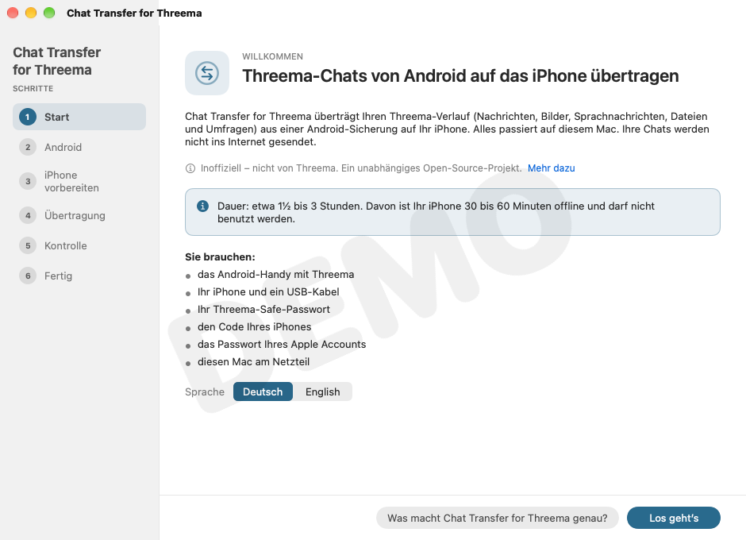

**Bitte lesen.** Lesen Sie die vier kurzen Absätze darüber, was sich am iPhone verändert, und setzen Sie das Häkchen.

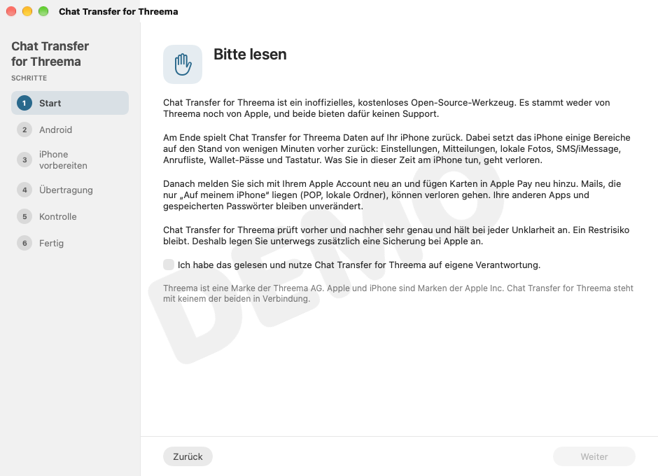

**Mac prüfen.** Chat Transfer for Threema prüft macOS, den Chip, den freien Speicher, den Speicherort (APFS), das Netzteil und
FileVault. Ist FileVault aus, sehen Sie eine Empfehlung: Während des Umzugs liegen lesbare Kopien Ihrer Chats auf dem
Mac, bis Sie am Ende aufräumen. Sie können einen anderen Speicherort wählen, zum Beispiel eine externe SSD im Format
APFS.

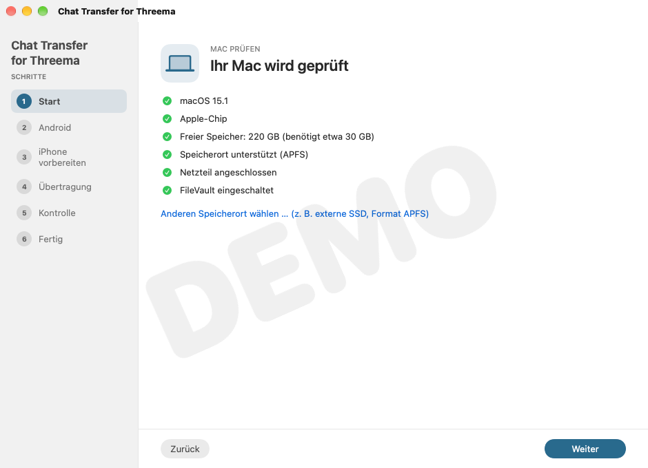

**iPhone kurz prüfen.** Schließen Sie das iPhone mit dem Kabel an und entsperren Sie es. Erscheint „Diesem Computer
vertrauen?“, tippen Sie auf „Vertrauen“ und geben Ihren Code ein. Bitte nur dieses eine iPhone anschließen. Chat Transfer for Threema
liest jetzt nur ein paar Angaben: Modell, iOS-Version, ob Threema installiert ist, freier Speicher, Akku und ob das
iPhone verwaltet wird. Am iPhone wird nichts verändert.

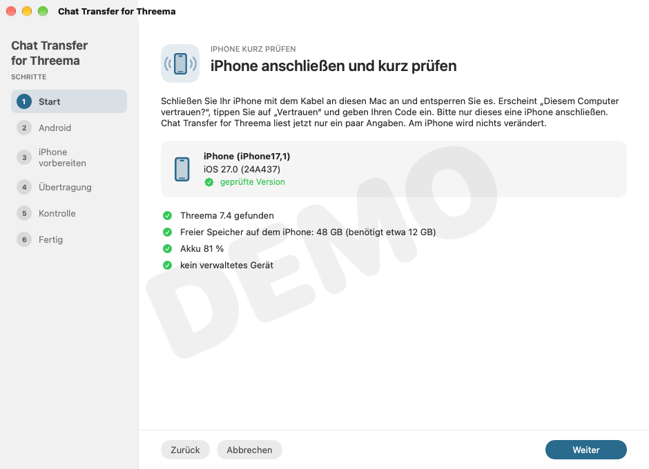

<!-- screenshot planned: ../../images/device/de/iphone-trust-this-computer.png -->

Ist Ihre iOS-Version noch nicht geprüft, wird die Karte rot. Chat Transfer for Threema überträgt dann nichts. Sie können den
Android-Teil schon vorbereiten und später mit einer neueren Version von Chat Transfer for Threema weitermachen. Bitte installieren Sie
bis dahin kein weiteres iOS-Update.

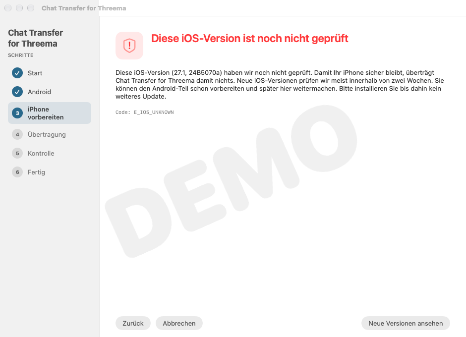

### Phase „Android“

**Android-Sicherung erstellen.** Auf dem Android-Handy:

1. Öffnen Sie Threema → ⋮ (oben rechts) → „Backups“ †.
2. Prüfen Sie, dass Threema Safe eingeschaltet ist und das letzte Safe-Backup von heute stammt. Das
   Threema-Safe-Passwort brauchen Sie gleich am iPhone.
3. Tippen Sie auf „Daten-Backup“ → „Daten-Backup erstellen“ †. Setzen Sie den Haken bei den Medien (Bilder, Videos,
   Dateien). Wählen Sie ein Passwort und notieren Sie es.
4. Warten Sie, bis die Sicherung fertig ist. Mit vielen Bildern dauert das eine Weile.

Kopieren Sie danach die Datei (sie beginnt mit `threema-backup_`) auf den Mac, am besten mit einem USB-Stick.
Cloud-Speicher geht auch, ist für private Chats aber nicht empfohlen.

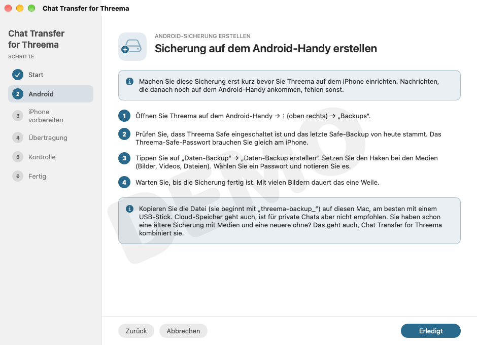

<!-- screenshot planned: ../../images/device/de/android-threema-backups.png -->

<!-- screenshot planned: ../../images/device/de/android-threema-safe.png -->

<!-- screenshot planned: ../../images/device/de/android-data-backup-media.png -->

**Sicherung wählen.** Ziehen Sie die Datei in das Fenster oder klicken Sie auf „Auswählen …“, geben Sie das Passwort
der Android-Sicherung ein und klicken Sie auf „Prüfen“. Das Passwort bleibt nur im Arbeitsspeicher der App. Haben Sie
eine ältere Sicherung mit Medien und eine neuere ohne, wählen Sie beide: Chat Transfer for Threema nimmt die Chats aus der neuesten
Sicherung und die Medien aus der älteren; Medien, die nur in den neueren Chats vorkommen, erscheinen als Platzhalter.

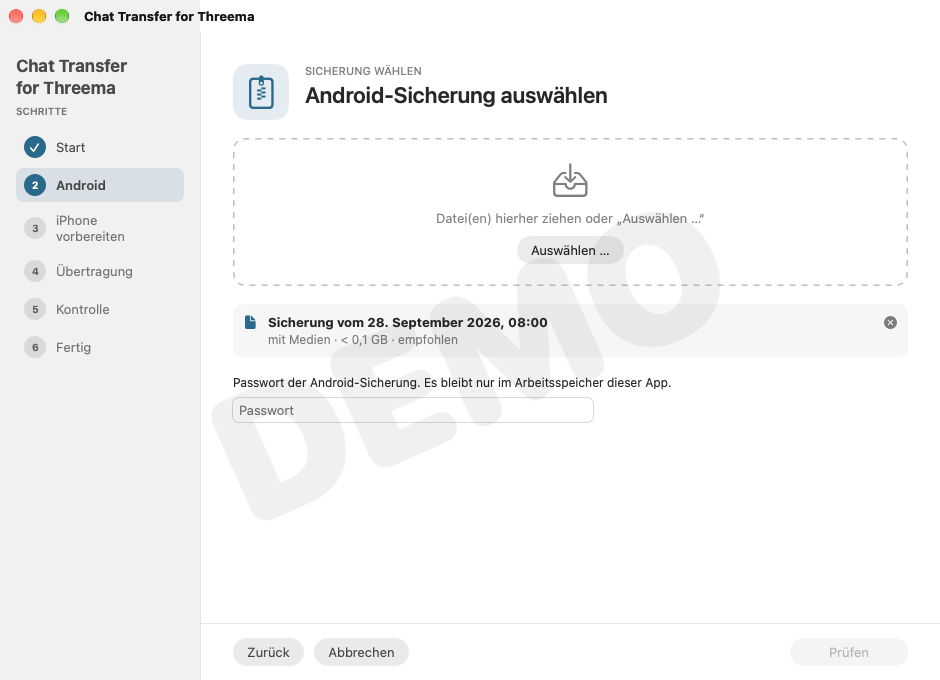

Mögliche Meldungen hier: Das Passwort passt nicht (auf Groß- und Kleinschreibung achten), die Datei ist unvollständig
(auf dem Android-Handy eine neue Sicherung erstellen) oder die Datei enthält nur Medien (zusätzlich die Sicherung mit
den Chats wählen).

**Chats werden vorbereitet.** Chat Transfer for Threema liest die Sicherung und entpackt die Medien. Am Ende sehen Sie eine
Zusammenfassung, zum Beispiel „Chats: 18 · Gruppen: 4 · Nachrichten: 12 345 · Medien: 1 234 · Umfragen: 2“. Zwei Hinweise
sind möglich: Eigene Nachrichten, die auf Android nie zugestellt wurden, erscheinen auf dem iPhone als gesendet. Und
Nachrichten von Personen, die nie in Ihren Kontakten waren, brauchen diese Personen als Kontakt auf dem iPhone
(nächster Schritt).

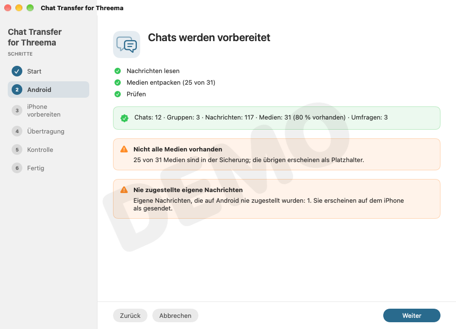

### Phase „iPhone vorbereiten“ (mit Internet)

**Threema auf dem iPhone.** Haken Sie jeden Punkt ab, wenn er erledigt ist:

1. Installieren Sie Threema aus dem App Store (die normale App, nicht Threema Work).
2. Beim ersten Start: „Backup wiederherstellen“ → „Threema Safe“ †. Threema-ID und Safe-Passwort eingeben. Ab jetzt
   gehört Ihre ID dem iPhone; auf dem Android-Handy funktioniert Threema danach nicht mehr.
3. Einrichtung abschließen und Threema einmal öffnen, bis die Chatliste zu sehen ist.
4. In Threema: Einstellungen → „Nachrichten behalten“ → „Für immer“ †. Wichtig: Sonst löscht Threema die übertragenen
   alten Nachrichten wieder.
5. Nur wenn die App eine Liste zeigt: Fügen Sie diese Personen in Threema als Kontakt hinzu (Kontakte → +). Sonst
   fehlen deren Gruppennachrichten.

Sie können Threema auf dem iPhone bis zum Schritt „iPhone offline schalten“ normal benutzen. Neue Chats bleiben
erhalten, der alte Verlauf wird dazusortiert.

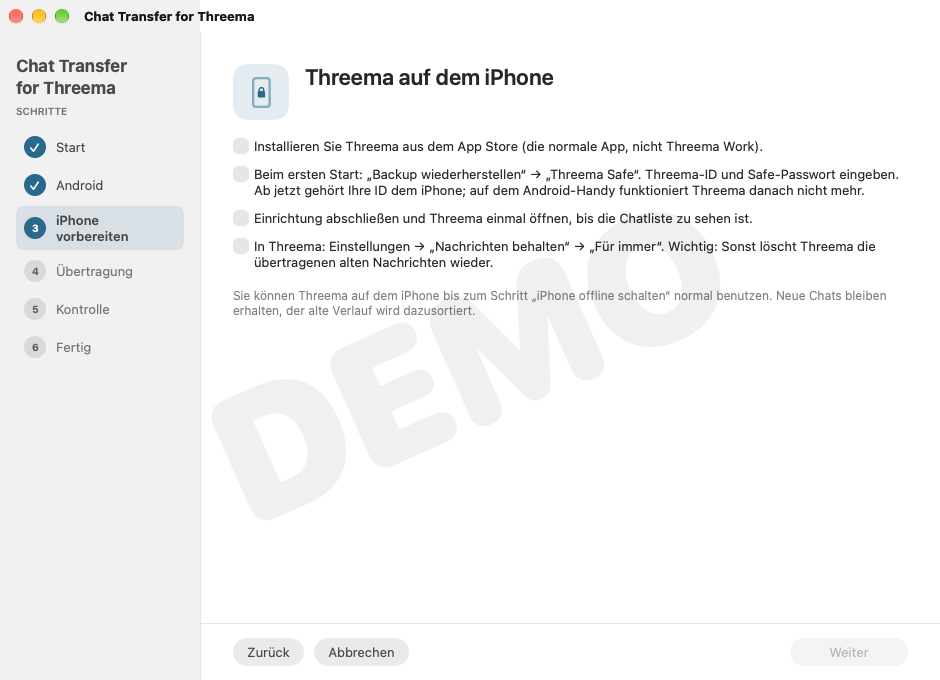

<!-- screenshot planned: ../../images/device/de/threema-ios-restore-safe.png -->

<!-- screenshot planned: ../../images/device/de/threema-ios-keep-messages.png -->

<!-- screenshot planned: ../../images/device/de/threema-ios-add-contact.png -->

**iPhone-Einstellungen.** Haken Sie jeden Punkt ab:

1. iOS-Updates aus: Einstellungen → Allgemein → Softwareupdate → Automatische Updates → alles aus †. Bis zum Ende kein
   Update installieren.
2. App-Updates aus: Einstellungen → Apps → App Store → App-Updates aus †.
3. „Wo ist?“ ausschalten, bitte zu Hause: Zuerst Einstellungen → Face ID & Code → „Schutz für gestohlene Geräte“ aus
   (falls an; unterwegs verzögert das iPhone diesen Schritt um eine Stunde). Dann Einstellungen → [Ihr Name] → Wo ist?
   → „Mein iPhone suchen“ aus (Apple-Account-Passwort nötig) †.
4. Akku mindestens 50 % oder am Ladekabel.

Am Ende sagt Ihnen die App, wann Sie alles wieder einschalten.

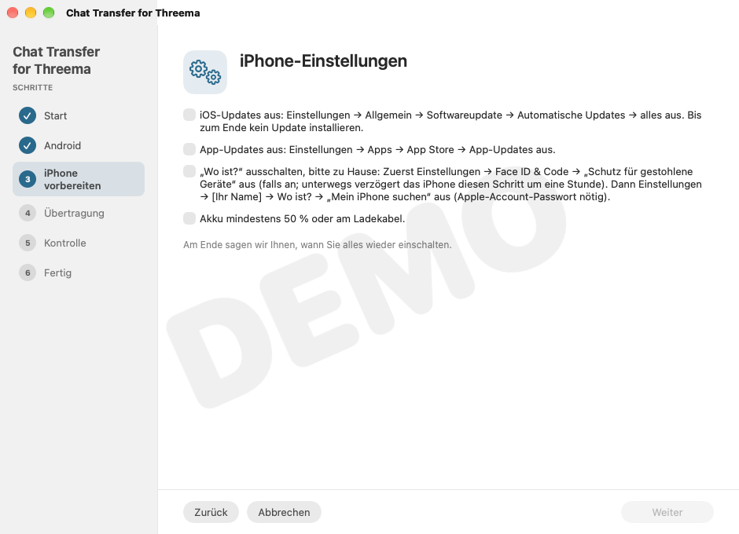

<!-- screenshot planned: ../../images/device/de/iphone-software-update-automatic.png -->

<!-- screenshot planned: ../../images/device/de/iphone-app-store-app-updates.png -->

<!-- screenshot planned: ../../images/device/de/iphone-stolen-device-protection.png -->

<!-- screenshot planned: ../../images/device/de/iphone-find-my.png -->

**Sicherheitsnetz bei Apple (Pflicht).** Falls etwas schiefgeht, brauchen Sie eine Sicherung, die Apple selbst
zurückspielen kann. Chat Transfer for Threema braucht sie nur im Notfall. Wählen Sie eine:

- **iCloud-Backup (einfach, kein extra Passwort):** Einstellungen → [Ihr Name] → iCloud → iCloud-Backup → „Jetzt
  sichern“ †. Warten Sie, bis „Letztes Backup: gerade eben“ dasteht. Dafür braucht Ihr iCloud-Speicher genug Platz.
- **Sicherung auf diesem Mac (ohne iCloud-Speicher):** Finder → Ihr iPhone → Allgemein → „Lokales Backup
  verschlüsseln“ → „Backup jetzt erstellen“. War das Häkchen noch aus, legen Sie dabei ein neues Passwort für
  iPhone-Sicherungen auf dem Mac fest: Notieren Sie es, die App fragt gleich danach. War es schon an, gilt Ihr
  bisheriges Passwort. Danach „Backups verwalten …“ → Rechtsklick auf das neue Backup → „Archivieren“. Die App sagt
  Ihnen, wie viel Platz das braucht.

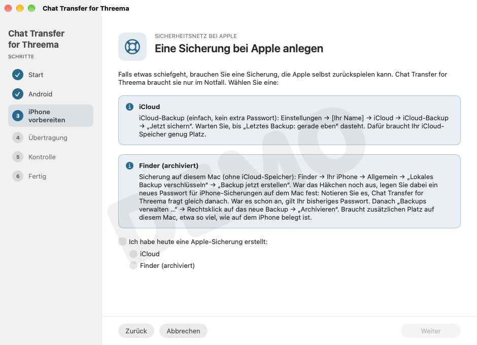

<!-- screenshot planned: ../../images/device/de/iphone-icloud-backup-now.png -->

<!-- screenshot planned: ../../images/device/de/mac-finder-encrypt-local-backup.png -->

<!-- screenshot planned: ../../images/device/de/mac-finder-archive-backup.png -->

**Passwort für iPhone-Sicherungen.** Chat Transfer for Threema braucht verschlüsselte iPhone-Sicherungen, denn nur diese enthalten
alle Daten. Gemeint ist das Passwort für iPhone-Sicherungen auf dem Mac: **nicht** der iPhone-Code, **nicht** das
Passwort Ihres Apple Accounts und **nichts** von iCloud. Ausführlich, auch wo Sie es vielleicht wiederfinden:
[Das Passwort für iPhone-Sicherungen](#das-passwort-für-iphone-sicherungen).

- Ist es noch **aus** („Ihr iPhone hat noch kein Sicherungs-Passwort“), erzeugt Chat Transfer for Threema ein Passwort für
  Sie (sechs Gruppen zu je vier Zeichen); genau dieses schützt ab jetzt Ihre Sicherungen. Schreiben Sie es
  auf und bewahren Sie es gut auf: Sie brauchen es für jede spätere Wiederherstellung aus einer Mac-Sicherung.
  Standardmäßig wird es zusätzlich im Schlüsselbund dieses Mac gesichert. Zur Kontrolle tippen Sie die letzten vier
  Zeichen ein; danach geben Sie am iPhone Ihren Code ein. Auf dem iPhone wird nichts gelöscht, und die Einstellung
  bleibt danach an.

  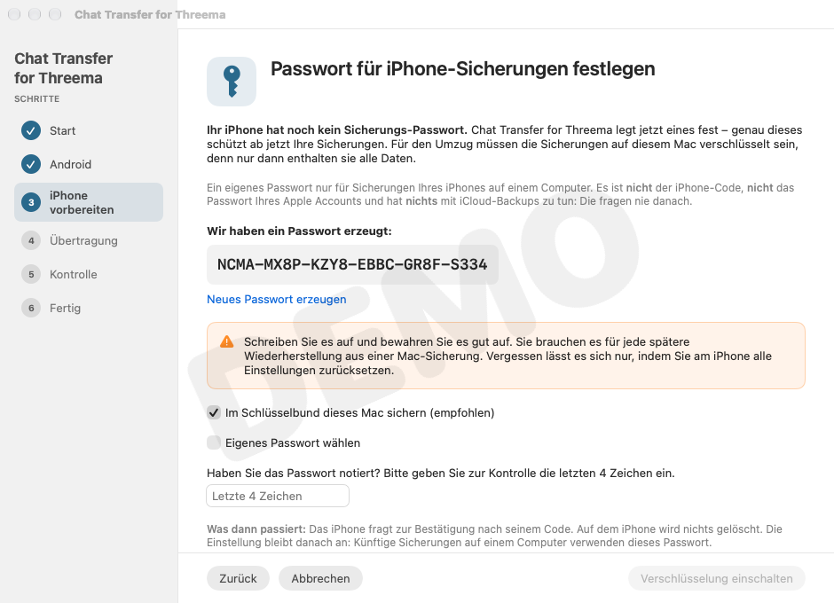

- Ist es schon **an**, verschlüsselt das iPhone jede Sicherung mit seinem gespeicherten Passwort; ein neues oder
  beliebiges Passwort funktioniert nicht. Die App fragt: „Kennen Sie dieses Passwort?“ Kennen Sie es, geben Sie es ein;
  die App prüft es gleich nach der ersten Sicherung, und ist es falsch, geben Sie es ohne neue Sicherung noch einmal
  ein. Kennen Sie es nicht, zeigt die App, wo Sie suchen können, und als letzten Weg Apples „Alle Einstellungen
  zurücksetzen“; nach **Erneut prüfen** legt sie dann ein neues Passwort fest.
- Haben Sie im Schritt davor die Finder-Sicherung gemacht und dabei „Lokales Backup verschlüsseln“ neu angehakt, hat
  der Finder die Verschlüsselung mit Ihrem eigenen Passwort eingeschaltet. Chat Transfer for Threema liest das nach dem
  Sicherheitsnetz neu und fragt nach genau diesem Passwort. Passt ein Passwort nicht, fragt die App jedes Mal neu
  nach; ein gespeichertes Passwort, das nicht passt, verwendet sie nicht noch einmal.

  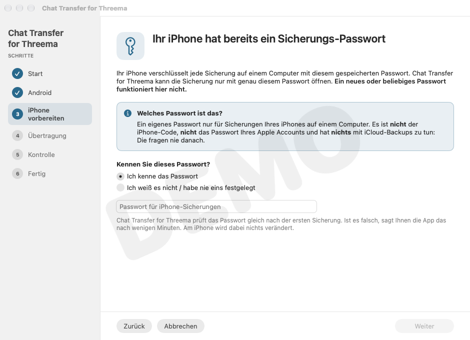

### Phase „Übertragung“ (das Zeitfenster)

**iPhone offline schalten.** Ab diesem Schritt bleibt Ihr iPhone bis zum Ende offline und unbenutzt (etwa 30 bis 60
Minuten). Fotos, Nachrichten und Einstellungen aus dieser Zeit würden sonst gelöscht.

1. Threema schließen: vom unteren Rand nach oben wischen und Threema nach oben wegschieben.
2. Falls Sie eine Apple Watch haben: Watch ausschalten. Bluetooth über Einstellungen → Bluetooth ausschalten (nicht
   nur im Kontrollzentrum).
3. Flugmodus an. Prüfen Sie im Kontrollzentrum, dass auch WLAN aus ist.
4. iPhone entsperrt am Kabel liegen lassen.

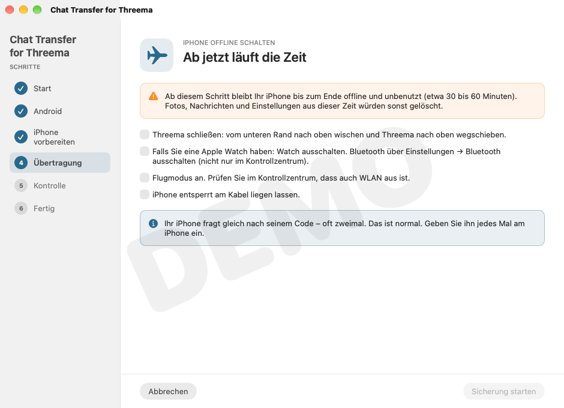

<!-- screenshot planned: ../../images/device/de/iphone-app-switcher-close-threema.png -->

<!-- screenshot planned: ../../images/device/de/iphone-settings-bluetooth.png -->

<!-- screenshot planned: ../../images/device/de/iphone-control-center-airplane-wifi-off.png -->

**Sicherung läuft.** Lassen Sie das Kabel stecken. Ihr iPhone fragt gleich nach seinem Code – oft zweimal. Das ist
normal; geben Sie ihn jedes Mal ein. Bricht die Sicherung nach wenigen Sekunden ab, startet Chat Transfer for Threema sie automatisch neu; das ist normal. Danach prüft Chat Transfer for Threema:
Passwort stimmt, Flugmodus war an, Threema eingerichtet, „Nachrichten behalten: Für immer“, Threema-Version
unterstützt, gleiche Threema-ID wie in der Android-Sicherung, lokale Fotos innerhalb der Grenze.

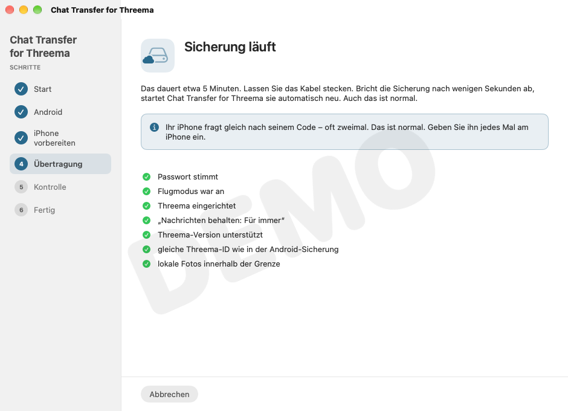

War der Flugmodus während der Sicherung nicht an, bittet Chat Transfer for Threema Sie, ihn einzuschalten, und macht eine neue
Sicherung.

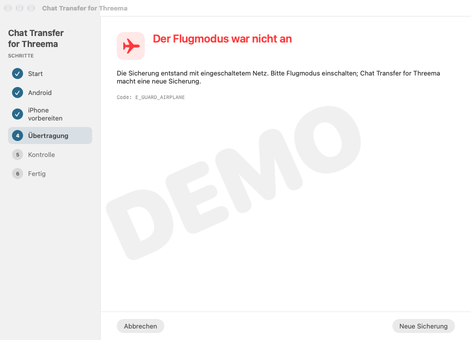

**Übertragung wird vorbereitet.** Chat Transfer for Threema fügt Ihren Verlauf in eine Kopie Ihrer iPhone-Daten ein und prüft alles
doppelt. Das iPhone wird dabei nicht verändert. Ein Countdown zeigt, bis wann die Übertragung starten muss: höchstens
60 Minuten nach der Sicherung.

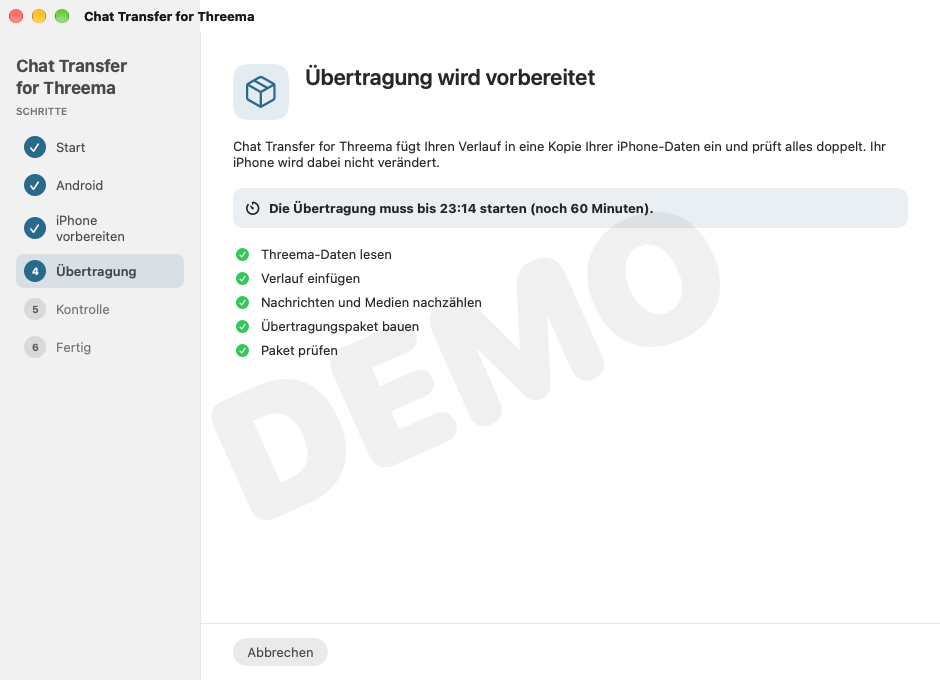

Läuft die Zeit ab, macht Chat Transfer for Threema einfach eine neue Sicherung und bereitet erneut vor. Das iPhone bleibt im
Flugmodus.

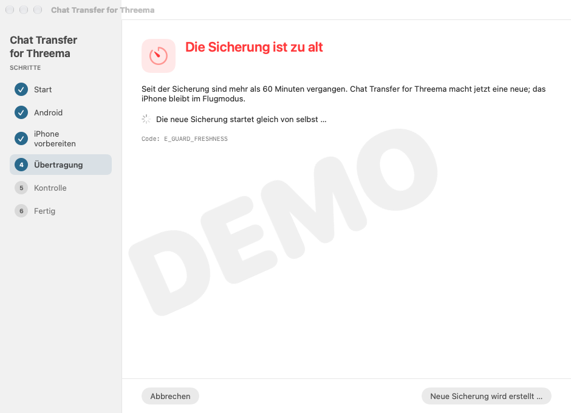

**Bereit zur Übertragung.** Der Bildschirm sagt Ihnen genau, was passiert, zum Beispiel „12 345 Nachrichten und
1 234 Medien (6,4 GB)“. Ist Ihr Android-Verlauf schon auf dem iPhone, steht dort: „Ihr Android-Verlauf ist bereits auf
dem iPhone – es kommt nichts Neues dazu.“ Außerdem erklärt er, was mit dem iPhone passiert: Einstellungen,
Mitteilungen, lokale Fotos, SMS/iMessage, Anrufliste, Wallet-Pässe und Tastatur kommen aus der Sicherung von vor
wenigen Minuten – sie bleiben also praktisch, wie sie sind. Das iPhone wird nicht gelöscht und nicht zurückgesetzt.
Neu machen müssen Sie danach nur zwei Dinge: beim Apple Account wieder anmelden und Ihre Apple-Pay-Karten wieder
hinzufügen. Setzen Sie beide Häkchen (Apple-Sicherung heute erstellt;
Apple-Account-Passwort zur Hand) und klicken Sie auf **Jetzt übertragen**. „Abbrechen“ geht hier noch, und am iPhone
wird nichts verändert.

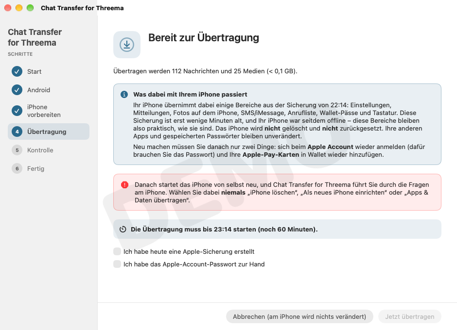

Direkt vor dem Senden prüft Chat Transfer for Threema noch einmal. Zwei typische Halte:

- Am iPhone wurden seit der Sicherung Fotos verändert: Chat Transfer for Threema macht eine neue Sicherung, damit kein Foto gelöscht
  wird. Bitte das iPhone nicht benutzen.

  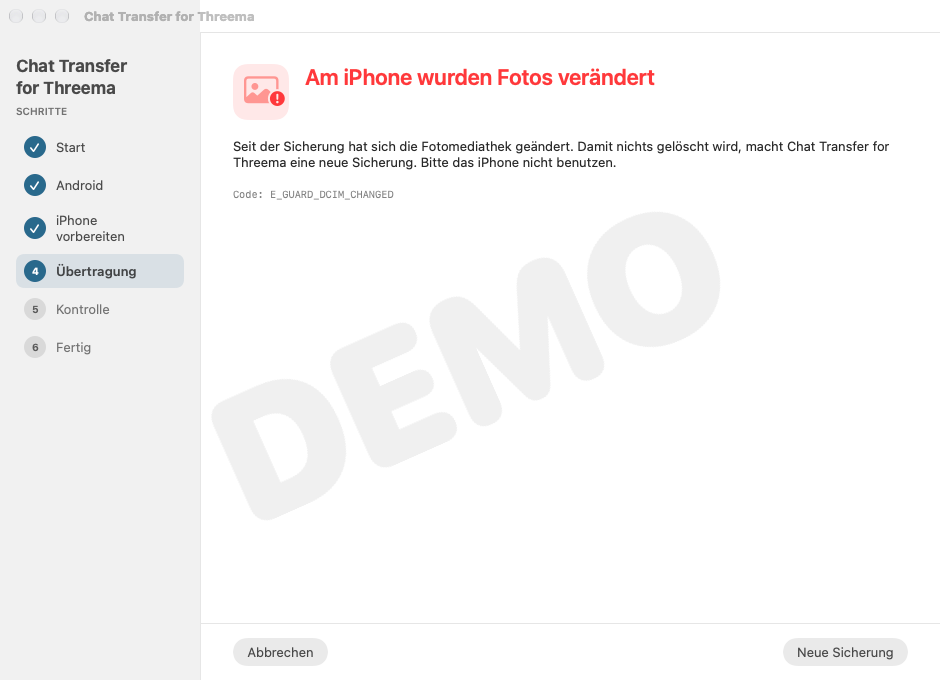

- „Wo ist?“ ist noch an: bitte ausschalten (Schritt „iPhone-Einstellungen“, Punkt 3) und erneut versuchen. Am iPhone
  wurde nichts verändert.

  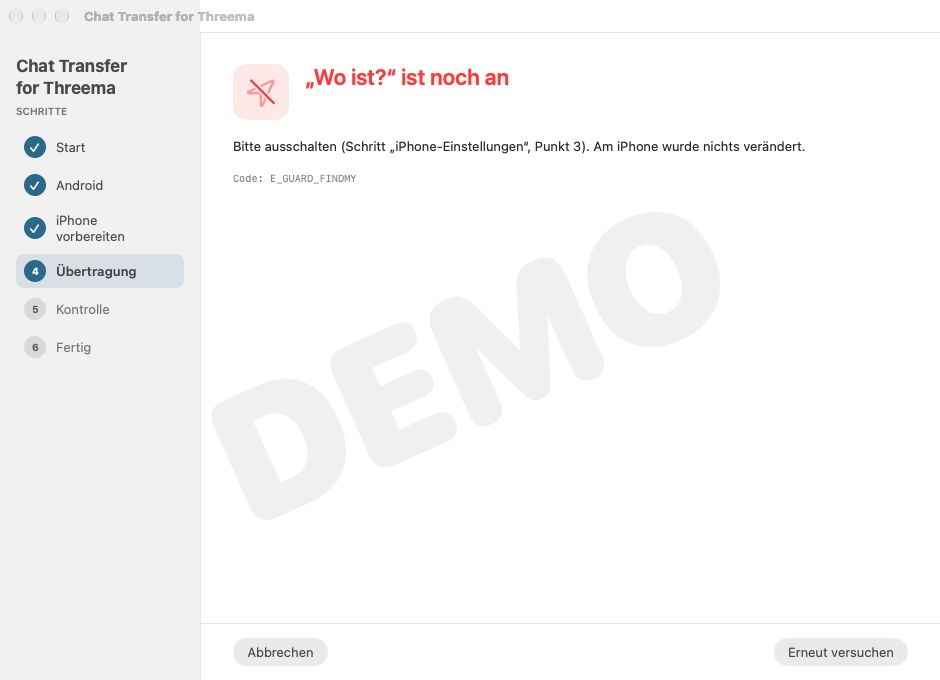

**Übertragung läuft. Kabel nicht trennen.** Am iPhone steht jetzt „Wiederherstellung läuft“ †. Geben Sie den Code
ein, falls gefragt. Tippen Sie sonst nichts an und klappen Sie den Mac nicht zu. „Abbrechen“ und das Beenden der App
sind in diesem Schritt gesperrt. Am Ende startet das iPhone von selbst neu, und die Verbindung zum Mac wird kurz
getrennt. Das ist normal.

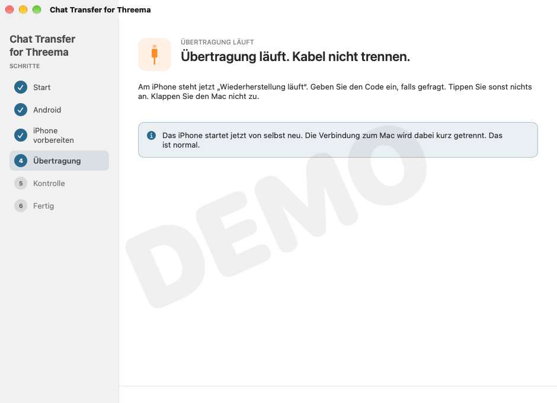

<!-- screenshot planned: ../../images/device/de/iphone-restore-in-progress.png -->

### Phase „Kontrolle“

**Am iPhone nach dem Neustart.** Sie sehen nacheinander †:

1. „Zum Aktualisieren nach oben wischen“ → nach oben wischen, Code eingeben.
2. „Wiederherstellung abgeschlossen“ → „Fortfahren“.
3. Apple Account → Passwort eingeben. Kommt das iPhone ohne Internet nicht weiter, wählen Sie „Später“. Flugmodus
   anlassen.
4. Apple Pay → „Später in Wallet einrichten“.
5. Home-Bildschirm.

Tippen Sie **nie** auf „iPhone löschen“, „Als neues iPhone einrichten“ oder „Apps & Daten übertragen“. Fragt das
iPhone nach Sprache oder Land: nichts antippen und in der Frage der App die zweite Antwort wählen.

Beantworten Sie dann die Frage der App: Welche Fragen hat Ihr iPhone nach dem Neustart gestellt? *Nur
„Wiederherstellung abgeschlossen“, Apple Account und/oder Apple Pay* · *Auch Sprache, Land oder „Apps & Daten“* · *Gar
keine Fragen*. Die erste und die dritte Antwort führen weiter zur Threema-Prüfung. Die zweite Antwort heißt: Das
iPhone steht im Setup-Assistenten. Dann gibt es keine Threema-Prüfung und keine Kontroll-Sicherung; die App zeigt
gleich den Weg zurück über Ihre Apple-Sicherung (R4, Kapitel 6).

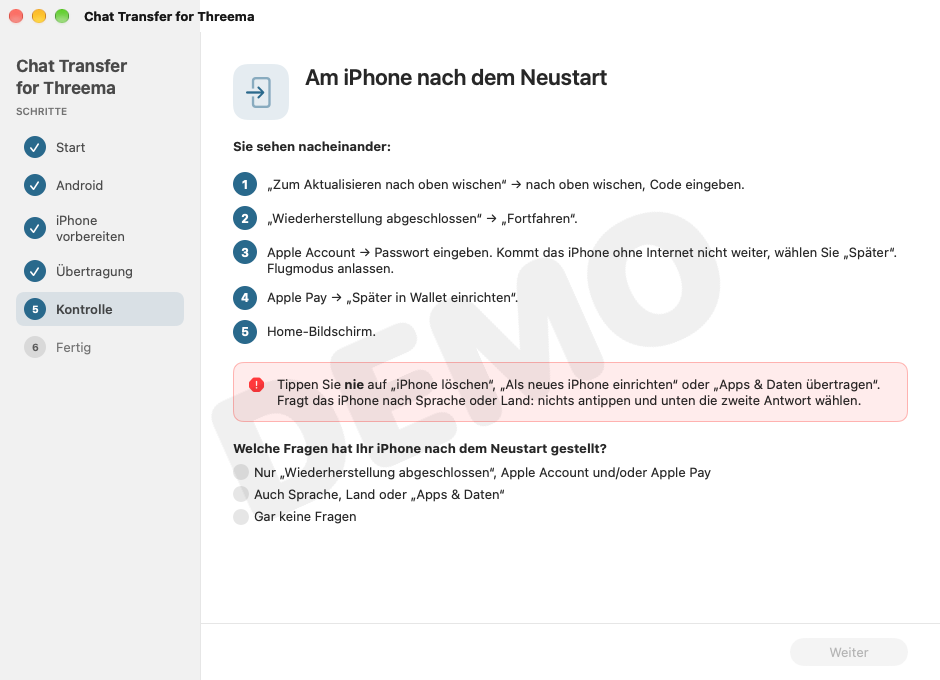

<!-- screenshot planned: ../../images/device/de/iphone-swipe-up-to-upgrade.png -->

<!-- screenshot planned: ../../images/device/de/iphone-restore-completed.png -->

<!-- screenshot planned: ../../images/device/de/iphone-apple-account-signin.png -->

<!-- screenshot planned: ../../images/device/de/iphone-apple-pay-later.png -->

Diese Bildschirme **nicht** antippen:

<!-- screenshot planned: ../../images/device/de/iphone-danger-transfer-apps-data.png -->

<!-- screenshot planned: ../../images/device/de/iphone-danger-erase.png -->

**Threema prüfen.** Öffnen Sie Threema auf dem iPhone, der Flugmodus bleibt an. Sind Ihre alten Chats da? Können Sie
in alten Nachrichten nach oben scrollen? Werden Bilder angezeigt? Der größte Chat braucht beim ersten Öffnen ein paar
Sekunden. Schließen Sie Threema danach wieder. Fragt Threema „Datenbank reparieren“ oder „Daten löschen“: nichts
antippen, Threema schließen und „Problem“ wählen.

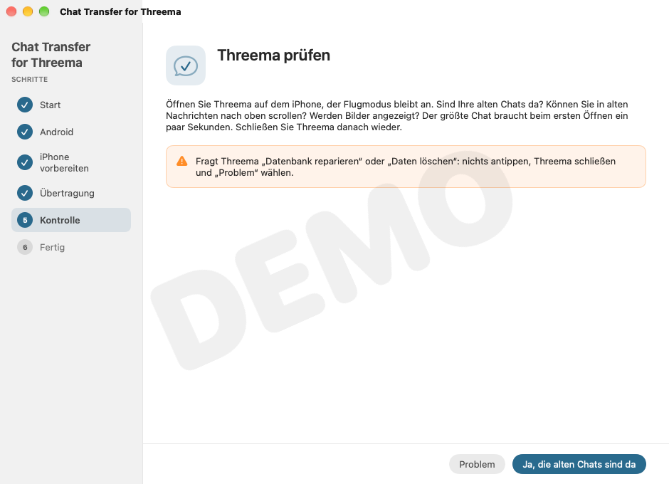

**Kontroll-Sicherung.** Chat Transfer for Threema macht eine zweite Sicherung und vergleicht sie mit der ersten. So sieht Chat Transfer for Threema,
ob außer Threema etwas verändert wurde. Geben Sie den Code am iPhone ein, wenn gefragt.

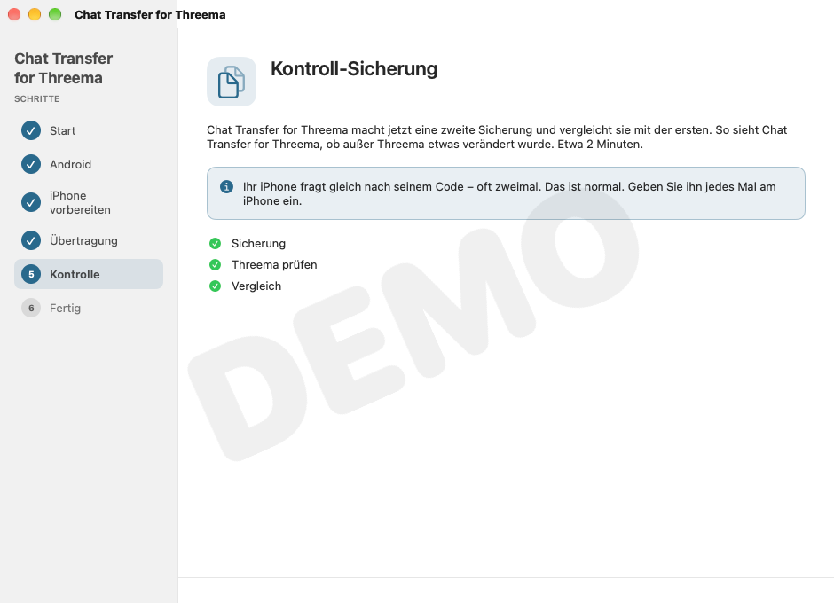

### Phase „Fertig“

**Geschafft!** Ihr Threema-Verlauf ist auf dem iPhone, und Ihre anderen Daten sind wie vorher. Hinweise unter dem
grünen Ergebnis sind bekannte, harmlose Effekte, zum Beispiel: Karten in Apple Pay bitte neu hinzufügen; der Kalender
gleicht sich nach dem Einschalten des Internets neu ab; die Uhr-Hintergründe wurden neu erzeugt; der Katalog der
Kurzbefehle wurde neu aufgebaut (Ihre Kurzbefehle sind da).

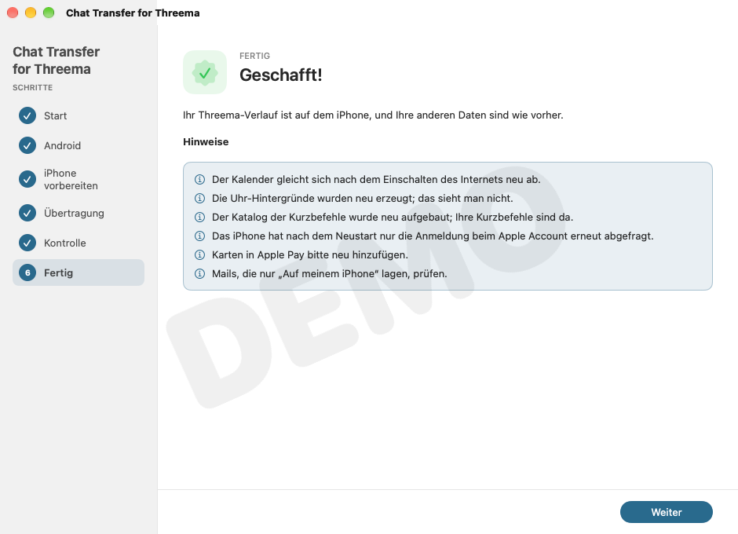

**Wieder einschalten und aufräumen.** Siehe Kapitel 5.

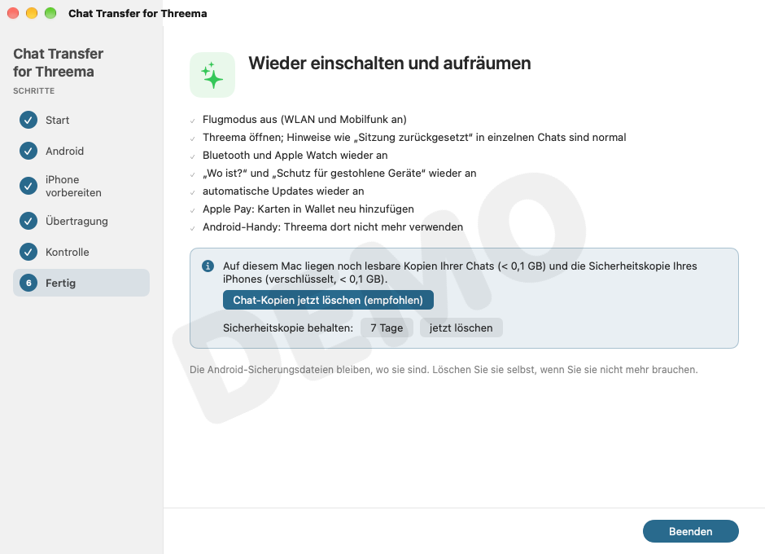

## 5. Nach dem Umzug

Schalten Sie alles wieder ein, in dieser Reihenfolge:

1. Flugmodus aus (WLAN und Mobilfunk an).
2. Threema öffnen. Hinweise wie „Sitzung zurückgesetzt“ in einzelnen Chats sind normal: Die Verschlüsselungs-Sitzungen
   werden neu ausgehandelt. Dabei geht kein Verlauf verloren.
3. Bluetooth und Apple Watch wieder an.
4. „Wo ist?“ und „Schutz für gestohlene Geräte“ wieder an.
5. Automatische Updates wieder an.
6. Apple Pay: Karten in Wallet neu hinzufügen.
7. Android-Handy: Threema dort nicht mehr verwenden.

**Aufräumen am Mac.** Auf dem Mac liegen noch lesbare Kopien Ihrer Chats und die Sicherheitskopie Ihres iPhones
(verschlüsselt). Klicken Sie auf „Chat-Kopien jetzt löschen“ (empfohlen). Die Sicherheitskopie können Sie 7 Tage
behalten oder gleich löschen; nach 7 Tagen schlägt die App das Löschen erneut vor. Die Android-Sicherungsdateien
bleiben, wo sie sind. Löschen Sie sie selbst, wenn Sie sie nicht mehr brauchen.

**Das Passwort für iPhone-Sicherungen bleibt an.** Chat Transfer for Threema schaltet die Verschlüsselung der iPhone-Sicherungen am
Ende nicht aus. Verschlüsselte lokale Sicherungen sind besser. Bewahren Sie das Passwort auf.

## 6. Wenn etwas schiefgeht

**Vor „Jetzt übertragen“ wurde am iPhone nichts verändert** (nur die Verschlüsselung der Sicherungen, falls Sie sie
eingeschaltet haben; sie bleibt an). Jeder Halt bis dahin sagt Ihnen, was zu tun ist: die Ursache beheben und erneut
versuchen, oder beenden.

**Wenn Sie vor dem Ende aufhören** (Abbrechen, Beenden, ein Halt ohne Weiter, Warten auf eine neue Version), schalten
Sie am iPhone wieder ein, was Sie für den Umzug ausgeschaltet haben: Flugmodus aus, Bluetooth und Apple Watch an,
„Wo ist?“ und „Schutz für gestohlene Geräte“ an, automatische Updates an. Wollen Sie später weitermachen, lassen Sie
iOS-Updates bis dahin aus. Die App zeigt diese Liste bei jedem solchen Halt.

Ein Halt mit oft einfacher Ursache: Die Android-Sicherung gehört zu einer anderen Threema-ID als Threema auf dem
iPhone. Prüfen Sie, ob Sie die richtige Datei gewählt haben.

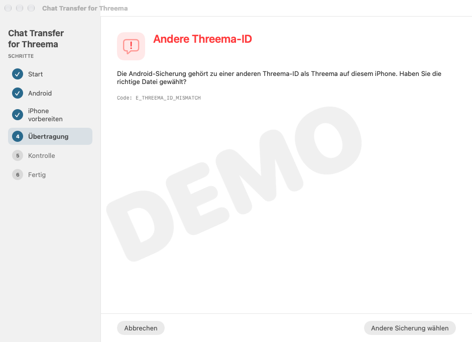

Ein verwandter Halt: **Threema-ID auf dem iPhone nicht lesbar.** Die App liest die Threema-ID des iPhones aus Ihren
Gruppen in Threema. Sind Sie in keiner Gruppe, kann sie den Vergleich nicht machen und hält an; am iPhone wurde nichts
verändert. Legen Sie dann in Threema auf dem iPhone eine Gruppe an, in der nur Sie selbst sind (eine Notizgruppe) †,
schließen Sie Threema wieder (der Flugmodus bleibt an) und klicken Sie auf „Neue Sicherung“.

**Nach der Übertragung** entscheidet die Kontroll-Sicherung. Findet sie etwas anderes als die erwarteten Änderungen,
hält die App auf einem roten Bildschirm an. Zuerst immer:

- Flugmodus **an** lassen, WLAN aus.
- Das iPhone heute Nacht nicht am WLAN laden, sonst überschreibt ein iCloud-Backup Ihre gute iCloud-Sicherung.
- Nichts am iPhone ändern.

Danach gilt einer von vier Wegen, und die App zeigt, welcher:

**Nur Threema hat den Verlauf nicht richtig übernommen (R1).** Ihr iPhone ist in Ordnung. Chat Transfer for Threema kann Threema auf
den Stand vor der Übertragung zurücksetzen, bis 6 Stunden nach der ersten Sicherung. Dabei gehen auch Einstellungen,
lokale Fotos und Tastatur auf diesen Stand zurück. Klicken Sie auf „Threema zurücksetzen“. Diesen Weg zeigt die App
auch, wenn Sie bei „Threema prüfen“ „Problem“ gewählt haben und alle anderen Prüfungen grün sind. Danach prüfen Sie
Threema noch einmal: Jetzt sollte es wieder so sein wie vor der Übertragung, ohne den Verlauf aus der
Android-Sicherung. Lehnt die App das Zurücksetzen ab (mehr als 6 Stunden, oder es wurde schon einmal
zurückgesetzt), bleiben die Wege von R2.

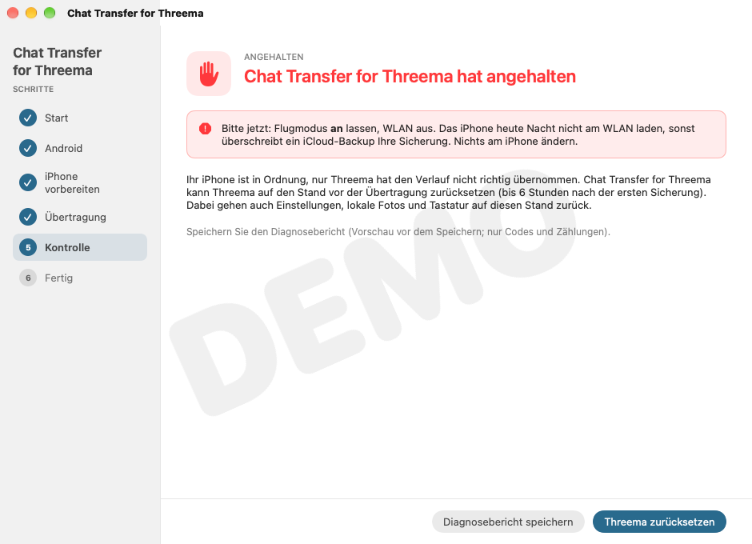

**Außer Threema hat sich etwas verändert (R2).** Die App nennt die Bereiche. Der sichere Weg zurück ist Ihre
Apple-Sicherung von heute (unten). Sie können das iPhone auch so lassen und die Bereiche von Hand nachziehen.

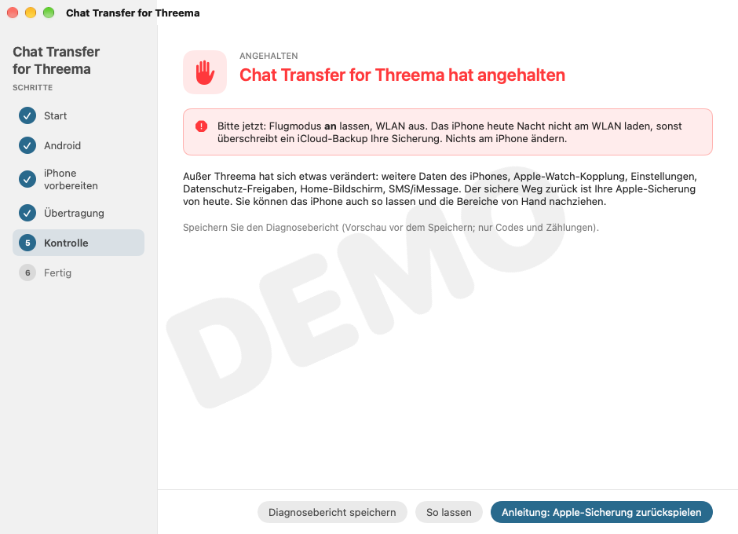

**Einige gespeicherte Anmeldungen fehlen (R2k).** Betroffene Apps fragen beim nächsten Öffnen nach Ihrer Anmeldung.
Ganz zurück holt das nur Ihre Apple-Sicherung.

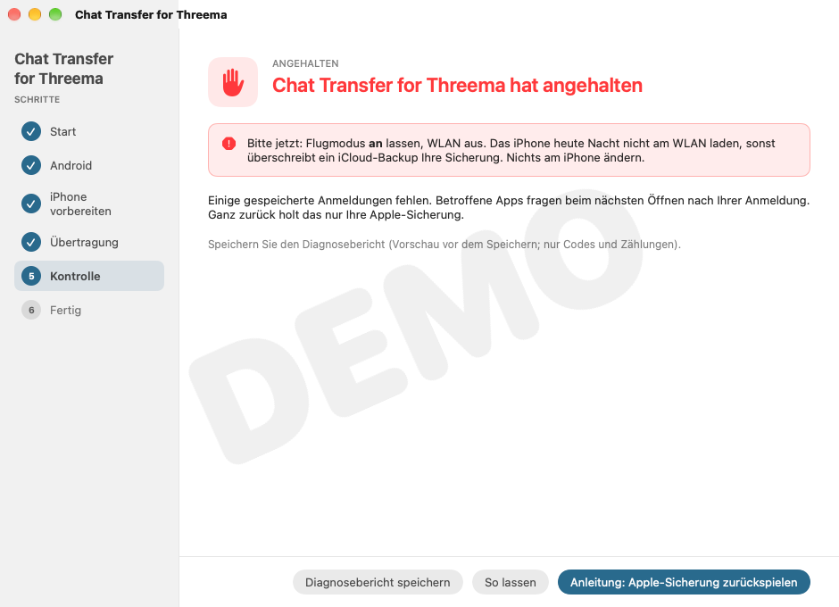

**Das iPhone möchte neu eingerichtet werden (R4).** Bitte nichts löschen und nicht „Als neues iPhone“ einrichten.
Folgen Sie der Anleitung zur Apple-Sicherung. Das iPhone steht dann schon im Setup-Assistenten; die Anleitung beginnt
dort (ohne Löschen).

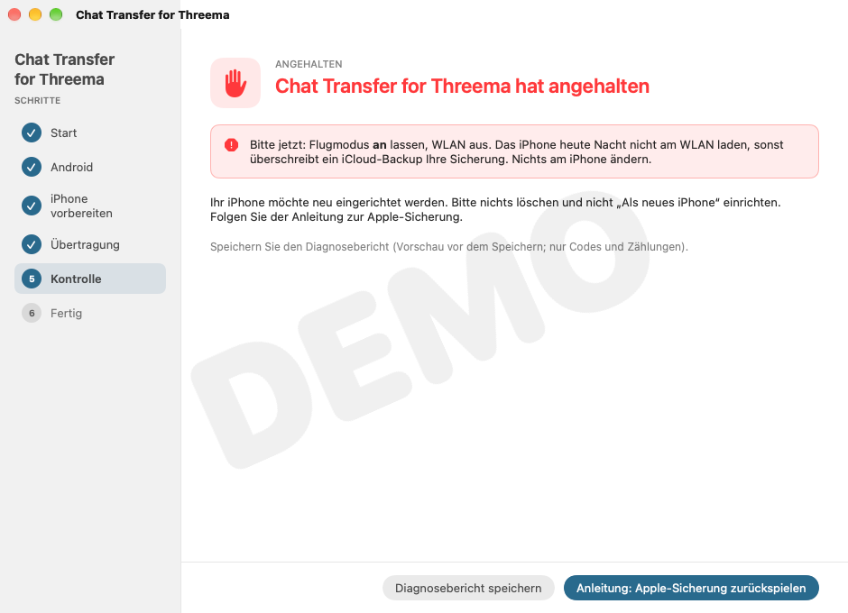

### Apple-Sicherung zurückspielen

Die App zeigt die Anleitung passend zu der Sicherung, die Sie im Schritt „Sicherheitsnetz bei Apple“ gemacht haben:

- **iCloud:**
  1. Zuerst prüfen: Einstellungen → [Ihr Name] → iCloud → iCloud-Backup †. Dort muss ein Backup von heute stehen, das
     vor der Übertragung entstanden ist (die App nennt die Uhrzeit). Steht dort kein solches Backup: **nichts
     löschen**, sondern „So lassen“ wählen.
  2. Nur wenn dieses Backup da ist: Einstellungen → Allgemein → iPhone übertragen/zurücksetzen → „Alle Inhalte &
     Einstellungen löschen“ †. Nur hier ist Löschen richtig: Ein iCloud-Backup lässt sich nur im Setup-Assistenten
     nach dem Löschen zurückspielen.
  3. Im Setup-Assistenten mit dem WLAN verbinden (dafür ist Internet nötig), „Aus iCloud-Backup“ wählen und das
     Backup von heute nehmen, das vor der Übertragung entstanden ist.

  Steht das iPhone schon im Setup-Assistenten (R4), entfallen Schritt 1 und 2: Sprache und Land wählen, mit dem WLAN
  verbinden, bei „Apps & Daten übertragen“ „Aus iCloud-Backup“ wählen †.
- **Finder:** iPhone anschließen → Finder → Ihr iPhone → „Backup wiederherstellen …“ → das **archivierte** Backup von
  heute wählen (Finder schlägt gern ein anderes vor) → Passwort eingeben. Steht das iPhone im Setup-Assistenten (R4),
  zeigt der Finder „Willkommen bei Ihrem neuen iPhone“: dort „Aus diesem Backup wiederherstellen“ wählen †.

Danach: beim Apple Account anmelden, Karten in Apple Pay neu hinzufügen; einzelne Banking- oder Authenticator-Apps
eventuell neu einrichten. Threema hat dann den Stand von vor dem Umzug; falls Threema nach der ID fragt, über Threema
Safe wiederherstellen. Schalten Sie danach wieder ein, was Sie für den Umzug ausgeschaltet hatten: Flugmodus aus,
Bluetooth und Apple Watch, „Wo ist?“ und „Schutz für gestohlene Geräte“, automatische Updates.

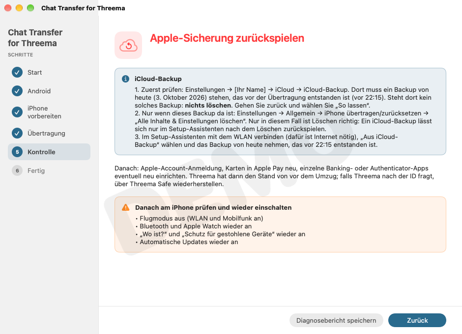

### Wenn die App oder der Mac angehalten hat

Starten Sie Chat Transfer for Threema neu. Es macht an der richtigen Stelle weiter. Wurde die Übertragung schon an das iPhone
gesendet, geht es immer mit der Kontrolle weiter, nie mit „Neu beginnen“.

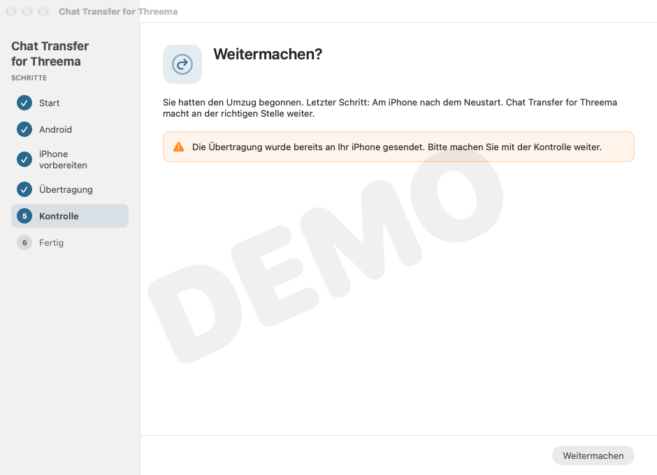

### Diagnosebericht

Auf jedem roten Bildschirm können Sie einen Diagnosebericht speichern. Vor dem Speichern sehen Sie eine Vorschau. Er
enthält Codes, Zählungen, Versionsnummern und das Ergebnis der Prüfungen; keine Namen, keine Nachrichten, keine
Threema-IDs, keine Telefonnummern. Hängen Sie ihn an eine Fehlermeldung an (Kapitel 10). Es wird nichts automatisch
hochgeladen.

## 7. Häufige Fragen

**Warum Flugmodus?** Die Wiederherstellung setzt einige Bereiche des iPhones auf den Moment der Sicherung zurück. Was
dazwischen ankommt, ginge verloren: Fotos, SMS und auch Threema-Nachrichten. Im Flugmodus warten neue
Threema-Nachrichten auf dem Server und kommen an, wenn Sie den Flugmodus ausschalten. Außerdem verhindert der
Flugmodus App- und iOS-Updates während der Übertragung.

**Warum ein Passwort für iPhone-Sicherungen?** Nur verschlüsselte iPhone-Sicherungen enthalten alle Daten, zum
Beispiel WLAN- und Health-Daten und gespeicherte Anmeldungen mancher Apps. Eine unverschlüsselte Sicherung hätte
Lücken.

**Ich habe nur iCloud-Backups gemacht und nie ein Passwort festgelegt. Welches Passwort will die App?** Das Passwort
für iPhone-Sicherungen auf dem Mac. Es ist nicht der iPhone-Code, nicht das Passwort Ihres Apple Accounts und hat
nichts mit iCloud zu tun. Fragt die App danach, ist es auf Ihrem iPhone schon eingeschaltet, oft seit Jahren und
vielleicht von einem früheren iPhone übernommen. Ein beliebiges neues Passwort funktioniert dann nicht: Die Sicherung
öffnet sich nur mit genau dem gespeicherten. Wählen Sie „Ich weiß es nicht / habe nie eins festgelegt“; die App zeigt,
wo Sie suchen können, und als letzten Weg Apples „Alle Einstellungen zurücksetzen“. Ist es aus, legt die App eines für
Sie an. Mehr: [Das Passwort für iPhone-Sicherungen](#das-passwort-für-iphone-sicherungen).

**Was passiert mit meinen Daten?** Alles bleibt auf Ihrem Mac. Chat Transfer for Threema öffnet keine Internetverbindung; das ist
technisch erzwungen. Lesbare Kopien Ihrer Chats liegen auf dem Mac, bis Sie am Ende aufräumen. Siehe Kapitel 8.

**Warum diese Warnung beim Öffnen?** Chat Transfer for Threema ist nicht bei Apple registriert (kostenpflichtiges
Entwicklerprogramm), deshalb kann macOS den Hersteller nicht bestätigen. Siehe Kapitel 3. Der Quellcode ist offen,
und jede Version hat eine Prüfsumme.

**Meine iOS-Version ist nicht dabei.** Chat Transfer for Threema überträgt nur auf iOS-Versionen, die am Gerät geprüft sind, weil iOS
die Wiederherstellung von Zeit zu Zeit ändert. Den Android-Teil können Sie schon vorbereiten; die Sitzung wartet.
Installieren Sie in der Zwischenzeit kein weiteres iOS-Update. Eine neuere Version von Chat Transfer for Threema folgt meist innerhalb
von zwei Wochen.

**Kann ich Threema auf Android weiter benutzen?** Nein. Sobald Sie Ihre ID mit Threema Safe auf dem iPhone
wiederherstellen, funktioniert Threema auf dem Android-Handy nicht mehr. Das ist bei Threema immer so, unabhängig von
Chat Transfer for Threema.

**Kann ich das zweimal machen?** Das ist nicht nötig. Ein zweiter Lauf überspringt Nachrichten, die schon auf dem
iPhone sind. Jeder Lauf ist aber eine weitere Wiederherstellung des iPhones; starten Sie ihn deshalb nur, wenn
Chat Transfer for Threema Sie dazu auffordert.

**Ist das erlaubt?** Chat Transfer for Threema arbeitet nur mit Ihren eigenen Sicherungen auf Ihren eigenen Geräten. Es steht in
keiner Verbindung zur Threema AG oder zur Apple Inc.

## 8. Datenschutz

- **Offline.** Die App öffnet keine Netzverbindung. Die Engine sperrt jede Netzverbindung außer der lokalen
  USB-Verbindung zum iPhone und läuft zusätzlich in einem macOS-Sandbox-Profil ohne Netzzugriff. Keine Nutzungsdaten,
  kein Absturzberichts-Dienst, keine Update-Prüfung. „Nach Updates suchen“ öffnet nur die Release-Seite im Browser.
- **Was während des Umzugs auf dem Mac liegt.** Ein Sitzungsordner in
  `~/Library/Application Support/Chat Transfer for Threema/sessions/`: der vorbereitete Android-Verlauf (lesbar), die
  iPhone-Sicherungen (verschlüsselt), Arbeitskopien und Berichte nur mit Zählungen. Nur Ihr Benutzer hat Zugriff; der
  Ordner ist von Time Machine ausgeschlossen und wird von Spotlight nicht durchsucht.
- **Passwörter.** Das Passwort der Android-Sicherung und ein von Ihnen eingetipptes iPhone-Sicherungs-Passwort bleiben
  nur im Arbeitsspeicher. Ein von Chat Transfer for Threema erzeugtes Passwort wird, wenn Sie zustimmen, im Schlüsselbund gespeichert
  („Chat Transfer for Threema – Backup-Passwort“).
- **Aufräumen.** Am Ende löscht „Chat-Kopien jetzt löschen“ die lesbaren Kopien. Die Sicherheitskopie Ihres iPhones
  können Sie 7 Tage behalten.
- **Diagnosebericht.** Nur auf Klick, mit Vorschau, als Datei. Nur Codes, Zählungen und Versionen. Nie hochgeladen.
- **Anzeige.** Die App zeigt nie den Gerätenamen oder Seriennummern Ihres iPhones; Threema-IDs erscheinen nur in der
  Liste der Personen, die Sie als Kontakt hinzufügen sollen.

Mehr: [../../PRIVACY.md](../../PRIVACY.md).

## 9. Deinstallieren

1. Chat Transfer for Threema beenden und aus „Programme“ in den Papierkorb ziehen.
2. Den Ordner `~/Library/Application Support/Chat Transfer for Threema` löschen (im Finder: Gehe zu → Gehe zum Ordner …). Darin liegen
   Ihre Sitzungsordner; löschen Sie ihn erst, wenn Sie die Sicherheitskopie nicht mehr brauchen.
3. In der Schlüsselbundverwaltung den Eintrag „Chat Transfer for Threema – Backup-Passwort“ löschen, wenn Sie ihn nicht mehr brauchen.
   Das Passwort selbst bleibt notiert: Es schützt weiterhin Ihre iPhone-Sicherungen.
4. Optional: Wenn Sie keine verschlüsselten iPhone-Sicherungen mehr möchten, schalten Sie im Finder „Lokales Backup
   verschlüsseln“ aus. Dafür brauchen Sie das Passwort.

## 10. Für Fortgeschrittene

**Download prüfen.** Jede Version hat eine Datei `SHA256SUMS`. Im Terminal:

```
cd ~/Downloads
shasum -a 256 -c SHA256SUMS --ignore-missing
```

Die Betas 0.9.x werden lokal gebaut und haben nur diese Prüfsummen. Eine minisign-Signatur (`SHA256SUMS.minisig`) und
eine Herkunftsbestätigung aus GitHub Actions (`gh attestation verify …`) sind ab Version 1.0 geplant.

**Aus dem Quellcode bauen.** Voraussetzungen: Mac mit Apple-Chip, Xcode, Python 3.13. Dann `git clone`, `make app`
(siehe `README.de.md` im Repository). Eine so gebaute App wird auf Ihrem Mac ad-hoc signiert.

**Fehler melden.** Öffnen Sie ein Issue mit der Vorlage „Bug report“ und hängen Sie den Diagnosebericht an. Hängen Sie
nie Sicherungen, Chat-Screenshots, Threema-IDs oder Gerätenamen an. Sicherheitsprobleme: siehe `SECURITY.md`.

**Wie es funktioniert** (auf Englisch): Wiederherstellungs-Mechanismus
[../../RESTORE-MECHANISM.md](../../RESTORE-MECHANISM.md) · Sicherheitsmodell
[../../SECURITY-MODEL.md](../../SECURITY-MODEL.md) · welche iOS-Versionen unterstützt sind und warum
[../../COMPAT-POLICY.md](../../COMPAT-POLICY.md).

---

Chat Transfer for Threema ist ein unabhängiges Open-Source-Projekt und steht in keiner Verbindung zur Threema AG oder zur Apple Inc. Es
wird von keinem der beiden unterstützt oder geprüft. Threema ist eine Marke der Threema AG. Apple, iPhone, Finder,
iCloud und Apple Pay sind Marken der Apple Inc. Die Namen werden nur verwendet, um die Kompatibilität zu beschreiben.
Nutzung auf eigene Verantwortung, ohne Gewähr (AGPL-3.0 §§ 15–16).
