# Chat Transfer for Threema user guide

> **Beta (0.9.0-beta.1).** Proven on a real iPhone (iOS 27.0, 24A437): the restore mechanism (a test restore that
> changed nothing) and the app's whole flow up to the transfer, where the iPhone itself refused because Find My was
> still on — nothing was changed. Not proven yet: a transfer carried out to the end by the app itself. If you depend
> on your iPhone every day or have no fresh Apple backup, please wait for a later version. The app screenshots come
> from the app's demo mode.

Chat Transfer for Threema is **unofficial**: it is not made by Threema AG, and Threema support cannot help with it.
In this guide, a menu path marked with **†** has not yet been checked on a device in both languages; the wording on
your iPhone or Android phone may differ slightly.

Deutsch: [../de/README.md](../de/README.md)

## Contents

1. [Overview](#1-overview)
2. [Before you start](#2-before-you-start)
3. [Installing](#3-installing)
4. [Step by step](#4-step-by-step)
5. [After the move](#5-after-the-move)
6. [If something goes wrong](#6-if-something-goes-wrong)
7. [Frequently asked questions](#7-frequently-asked-questions)
8. [Privacy](#8-privacy)
9. [Uninstalling](#9-uninstalling)
10. [For advanced users](#10-for-advanced-users)

---

## 1. Overview

**What Chat Transfer for Threema does.** Chat Transfer for Threema moves your Threema history (messages, pictures, voice messages, files and polls)
from a Threema data backup made on Android to Threema on your iPhone. Your iPhone is **not** erased or set up as new.
Everything happens on your Mac, with a USB cable to the iPhone. Your chats are never sent to the internet.

**How it works, in one paragraph.** You make a data backup in Threema on the Android phone and copy it to the Mac.
You set up Threema on the iPhone with Threema Safe as usual. Chat Transfer for Threema then makes a backup of the iPhone, adds your old
history to a copy of the iPhone's Threema data, checks everything twice and sends it back to the iPhone in one
restore. After the iPhone restarts, Chat Transfer for Threema makes a second backup and compares it with the first one to confirm that
nothing other than Threema changed.

**What Chat Transfer for Threema does not do.**

- It is **not** made by Threema or Apple, and neither of them supports it. It is an unofficial, free, open-source tool.
- It does not move your Threema ID, contacts or settings. That is what Threema Safe does, and you use Threema Safe
  yourself on the iPhone.
- It does not work with Threema Work or Threema OnPrem, with iPhones managed by a company or school, with Intel Macs
  or Windows, or in the other direction (iPhone to Android).
- It does not merge two different Threema IDs. The Android backup and the iPhone must use the same Threema ID.
- It does not transfer anything on an iOS version it has not tested. It then stops before the iPhone is changed.
- It does not replace an Apple backup. You make one yourself on the way, as a safety net.
- It does not connect to the internet, has no account, no telemetry and no automatic updates.

**What changes on the iPhone.** The restore puts some areas of the iPhone back to the state of a few minutes earlier:
settings, notifications, photos stored on the iPhone, SMS/iMessage, call history, Wallet passes and keyboard. Anything
you do on the iPhone during that time is lost, which is why the iPhone stays in airplane mode and unused. Afterwards
you sign in to your Apple Account again and add your Apple Pay cards again. Mail stored only "On My iPhone" (POP,
local folders) may be lost. Your other apps and saved passwords stay as they are.

## 2. Before you start

### What you need

| | |
|---|---|
| Mac | Mac with Apple silicon (M1 or newer), macOS 14 or later, connected to power |
| Space on the Mac | room for two backups of your iPhone plus the unpacked Android backup; the app tells you the exact amount |
| iPhone | an iOS version that Chat Transfer for Threema has tested (the app checks this first, read-only) |
| Threema | the regular Threema app from the App Store on the iPhone; the Android phone with Threema |
| Cable | a USB cable between iPhone and Mac (no Wi-Fi sync) |
| Passwords | your Threema Safe password, your iPhone passcode, your Apple Account password, the password of the Android data backup, and the password for iPhone backups if one is already turned on ([what that is](#the-iphone-backup-password)) |
| Apple backup | room in iCloud for an iCloud Backup, or room on the Mac for a Finder backup |
| Time | about 1½ to 3 hours. For 30 to 60 minutes of that, your iPhone is offline and must not be used |

### Limits of version 1

- Photos stored on the iPhone: at most 20 GB. With "Optimize iPhone Storage" in iCloud Photos the local part is
  usually much smaller †.
- Threema: only the regular app (no Threema Work, no OnPrem). Chat Transfer for Threema only writes into a Threema data model it knows
  exactly; after a Threema update that changes the data model, it waits for a Chat Transfer for Threema update.
- iOS: only tested versions. New iOS versions are usually tested within two weeks. Do not install iOS updates while
  you are planning the move.
- Android backups: only the backup format that has been tested. A backup from a newer Threema for Android version is
  refused with a clear message.
- iPhones managed by a company or school are not supported.

### Good to know beforehand

- **Make the Android backup late.** Messages that arrive on the Android phone after the backup are not included.
  The best time is right before you set up Threema on the iPhone.
- **People who are not your contacts.** If old group messages come from people who were never in your Threema
  contacts, Chat Transfer for Threema shows you their Threema IDs. Add them as contacts in Threema on the iPhone before the transfer;
  otherwise those messages are missing.
- **Find My.** You turn off "Find My iPhone" for the transfer. If Stolen Device Protection is on, the iPhone delays
  this by one hour when you are away from home. Do it at home.

### The iPhone backup password

Chat Transfer for Threema works with backups of your iPhone on this Mac. These backups have to be encrypted, because only then do they
contain all data. That is what the **password for iPhone backups on the Mac** is for:

- It is a separate password only for backups of your iPhone on a computer.
- It is **not** the passcode you use to unlock your iPhone.
- It is **not** your Apple Account password.
- It has **nothing** to do with iCloud backups. iCloud backups never ask for it. Even if you have only ever made
  iCloud backups, it can still be turned on for your iPhone (case 2).

The setting belongs to the iPhone, not to the Mac. Chat Transfer for Threema reads which case applies to you and shows the matching
screen.

**Case 1: no password is turned on yet.** This is the most common case. Chat Transfer for Threema creates a password for you (six
groups of four characters), or you choose your own (at least 10 characters). Write it down; to confirm, you type its
last four characters. By default Chat Transfer for Threema also saves it in this Mac's keychain ("Chat Transfer for Threema – Backup-Passwort"). Then
click "Turn on encryption":

- The iPhone asks for its passcode to confirm. Enter it on the iPhone.
- Nothing on the iPhone is deleted.
- The setting stays on afterwards. Future backups on a computer use this password, and you need it to restore such a
  backup later.

**Case 2: a password is already turned on.** Then your iPhone encrypts every backup on a computer with this stored
password, and Chat Transfer for Threema can open the backup only with exactly this password. **A new or made-up password
does not work here.** The app therefore asks: "Do you know this password?"

- **I know the password:** enter it. The app checks it right after the first backup. If it is wrong, the app tells you
  within a few minutes; nothing on the iPhone is changed, and no new backup is needed for another try.
- **I don't know it / never set one:** this is common. Usually the password was set years ago in iTunes or Finder
  ("Encrypt local backup") or with another iPhone program; the setting can move along to a new iPhone, also via an
  iCloud backup. The app then shows these steps:

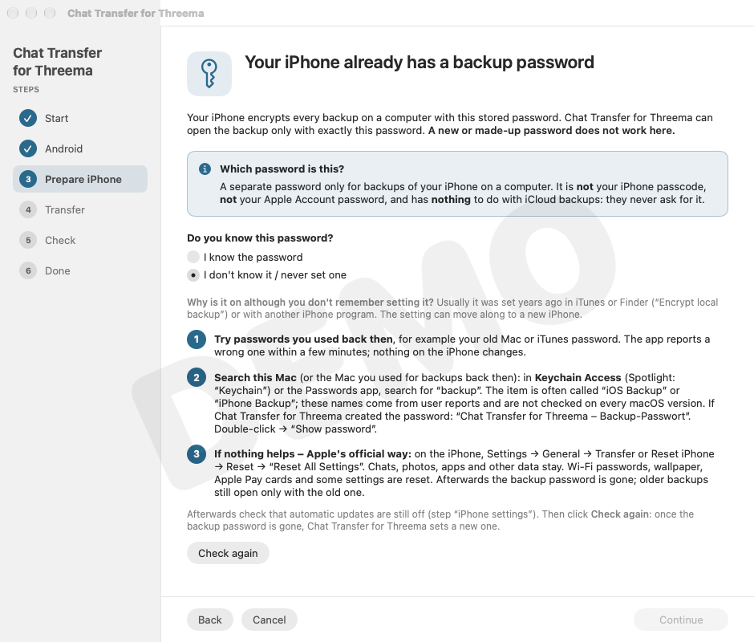

1. **Try passwords you used back then**, for example your old Mac or iTunes password.
2. **Search this Mac** (or the Mac you used for backups back then): open **Keychain Access** (Spotlight, ⌘-Space →
   "Keychain"; the Passwords app may not show such items †) and search for "backup" in the top-right search field
   (otherwise "iPhone" or "iOS"). The item is usually called "iOS Backup" or "iPhone Backup" †; if Chat Transfer for
   Threema created the password, "Chat Transfer for Threema – Backup-Passwort". Double-click → "Show password" → confirm
   with your Mac password. The names "iOS Backup" and "iPhone Backup" come from user reports; we have not checked them
   on every macOS version.
3. **If nothing helps: Apple's official way.** On the iPhone, Settings → General → Transfer or Reset iPhone → Reset →
   "Reset All Settings" †. Chats, photos, apps and other data stay; Wi-Fi passwords, wallpaper, Apple Pay cards and
   some settings are reset. Afterwards the backup password is gone; older encrypted backups still open only with the old
   password. Check that automatic updates are still off and click **Check again** in the app: it reads the iPhone again
   and sets a new password as in case 1. If your safety net was a Finder backup, it is encrypted with the old password;
   then also make an iCloud backup.

The screen "Wrong iPhone backup password" opens the same help with "Don't know the password? Here is how to go on".

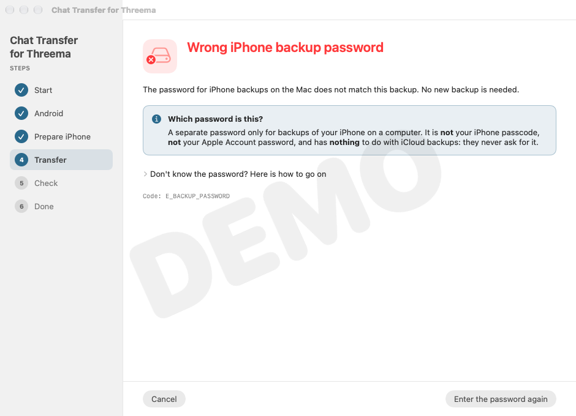

## 3. Installing

Chat Transfer for Threema is free and not registered with Apple (that costs 99 USD per year), so macOS cannot confirm the developer
and asks you once to allow it. The source code is public, and every version has a checksum.

**Download:** there is no release yet. Releases will appear on the project's *Releases* page as
`threema-chat-transfer-X.Y.Z.dmg` with a `SHA256SUMS` file.

### Opening Chat Transfer for Threema for the first time ("Open Anyway")

1. Open `threema-chat-transfer-X.Y.Z.dmg` and drag Chat Transfer for Threema into the "Applications" folder. Do not start Chat Transfer for Threema directly from the
   DMG.

   <!-- screenshot planned: ../../images/gatekeeper/en/macos27-step1.png -->

2. Open Chat Transfer for Threema in "Applications". macOS says *"Chat Transfer for Threema" Not Opened*. Click **Done** (not "Move to Trash").

   <!-- screenshot planned: ../../images/gatekeeper/en/macos27-step2.png -->

3. Open System Settings → Privacy & Security and scroll down to "Security". Next to *"Chat Transfer for Threema" was blocked …* click
   **Open Anyway**.

   <!-- screenshot planned: ../../images/gatekeeper/en/macos27-step3.png -->

4. Confirm with **Open Anyway** and your Mac password or Touch ID. This is only needed the first time.

   <!-- screenshot planned: ../../images/gatekeeper/en/macos27-step4.png -->

On macOS 14 you can also use the old way: right-click Chat Transfer for Threema in "Applications" → **Open** → **Open**.

<!-- screenshot planned: ../../images/gatekeeper/en/macos14-rightclick-open.png -->

The steps look the same on macOS 15 and 26. Pictures for every version are in the release notes.

**If macOS says the app "is damaged"**, the download is broken. Delete it, download it again and compare the
checksum (chapter 10). Never follow instructions from the internet that tell you to paste commands into Terminal to
"fix" an app.

## 4. Step by step

The app guides you through six phases, shown in its sidebar: **Start · Android · Prepare iPhone · Transfer · Check ·
Done**. You can go back freely until the iPhone backup starts. From "Take your iPhone offline" on, going back is
locked because the clock is running. Until you press "Transfer now" you can cancel at any time, and nothing on the
iPhone has been changed.

The example numbers in the pictures (18 chats, 4 groups, 12 345 messages, 1 234 media, 2 polls, 6.4 GB,
iOS 27.0 (24A437), Threema 7.4) come from the demo mode, not from a real person.

### Phase "Start"

**Welcome.** The first screen tells you what the move does, how long it takes and what you need. You can switch the
language here.

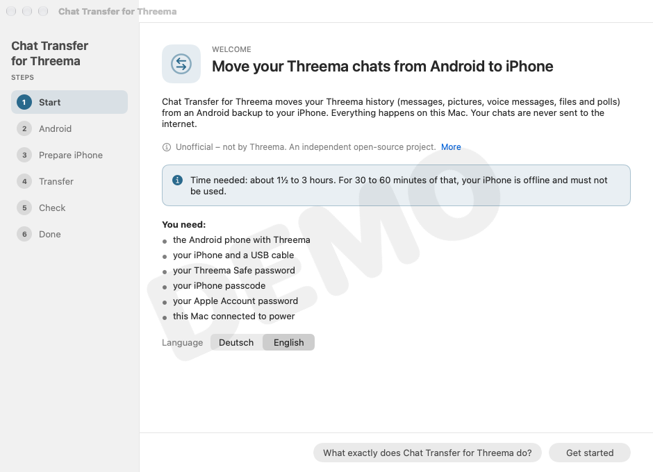

**Please read.** Read the four short paragraphs about what changes on the iPhone, and tick the box.

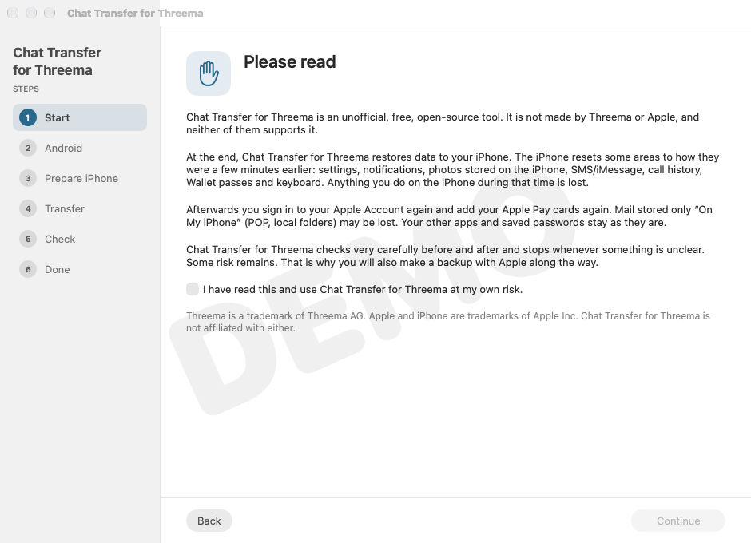

**Checking your Mac.** Chat Transfer for Threema checks macOS, the chip, free space, the storage location (APFS), the power adapter
and FileVault. If FileVault is off you see a recommendation: during the move, readable copies of your chats are on
the Mac until you clean up at the end. You can choose another location, for example an external SSD formatted as
APFS.

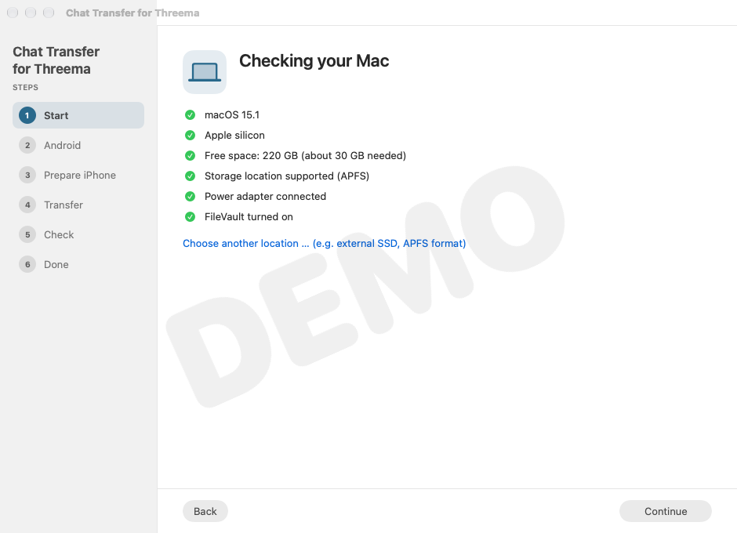

**Quick iPhone check.** Connect the iPhone with the cable and unlock it. If "Trust This Computer?" appears, tap
"Trust" and enter your passcode. Connect only this one iPhone. Chat Transfer for Threema only reads a few details now: model, iOS
version, whether Threema is installed, free space, battery, and whether the iPhone is managed. Nothing on the iPhone is
changed.

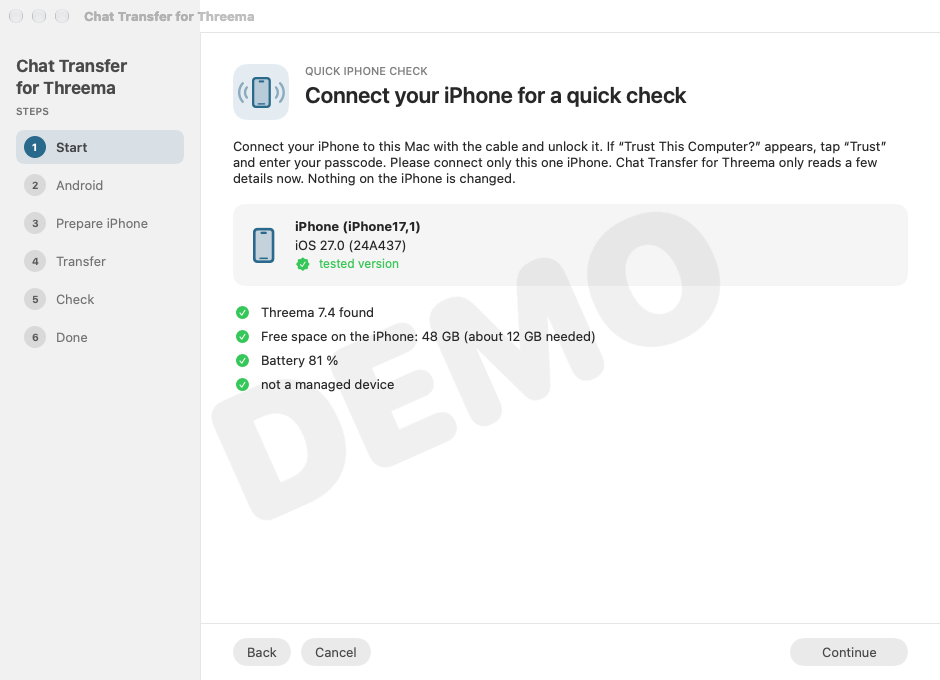

<!-- screenshot planned: ../../images/device/en/iphone-trust-this-computer.png -->

If your iOS version has not been tested yet, the card turns red. Chat Transfer for Threema then transfers nothing. You can already
prepare the Android part and continue later with a newer version of Chat Transfer for Threema. Please do not install another iOS
update until then.

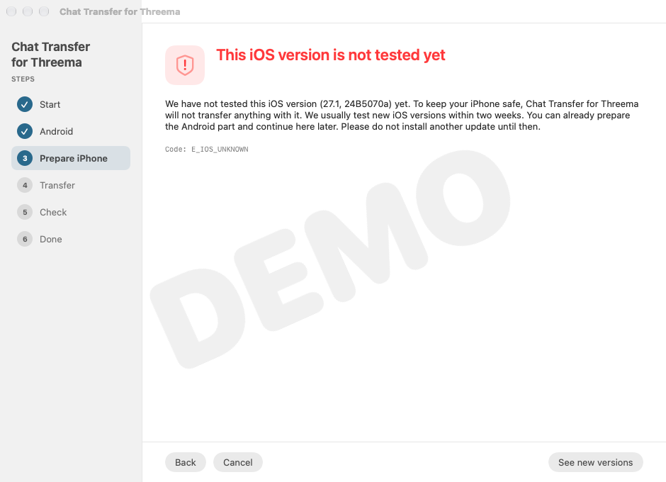

### Phase "Android"

**Create the Android backup.** On the Android phone:

1. Open Threema → ⋮ (top right) → "Backups" †.
2. Check that Threema Safe is on and that the latest Safe backup is from today. You will need the Threema Safe
   password on the iPhone shortly.
3. Tap "Data backup" → "Create data backup" †. Tick the option to include media (pictures, videos, files). Choose a
   password and write it down.
4. Wait until the backup is finished. With many pictures this takes a while.

Then copy the file (its name starts with `threema-backup_`) to the Mac, ideally with a USB stick. Cloud storage also
works but is not recommended for private chats.

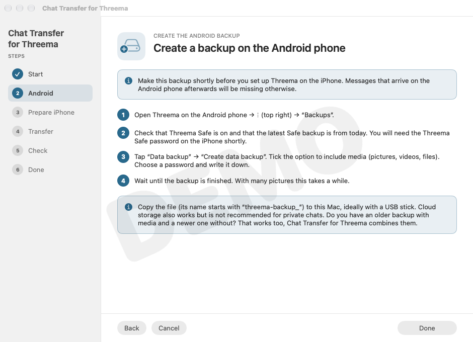

<!-- screenshot planned: ../../images/device/en/android-threema-backups.png -->

<!-- screenshot planned: ../../images/device/en/android-threema-safe.png -->

<!-- screenshot planned: ../../images/device/en/android-data-backup-media.png -->

**Choose the backup.** Drag the file into the window or click "Choose …", enter the password of the Android backup and
click "Check". The password stays only in the app's memory. If you have an older backup with media and a newer one
without, choose both: Chat Transfer for Threema takes the chats from the newest backup and the media from the older one; media that
are only in the newer chats appear as placeholders.

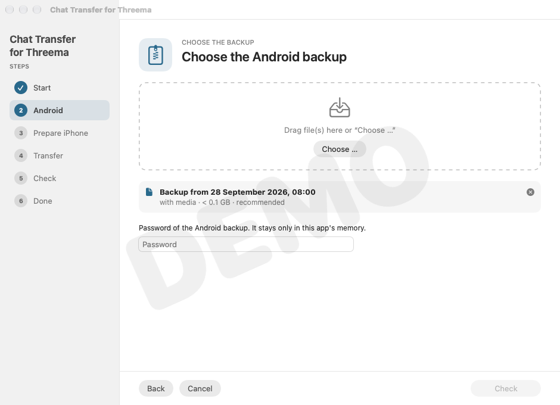

Possible messages here: the password does not match (check upper and lower case), the file is incomplete (create a
new backup on the Android phone), or the file contains only media (also choose the backup with the chats).

**Preparing your chats.** Chat Transfer for Threema reads the backup and unpacks the media. At the end you see a summary, for example
"Chats: 18 · Groups: 4 · Messages: 12 345 · Media: 1 234 · Polls: 2". Two notes may appear: your own messages that were
never delivered on Android will appear as sent on the iPhone; and messages from people who were never in your
contacts need those people as contacts on the iPhone (next step).

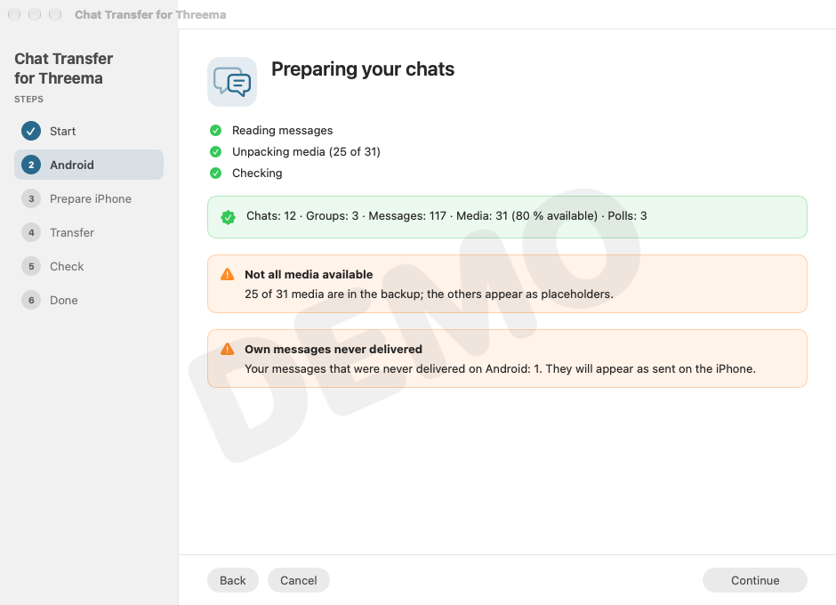

### Phase "Prepare iPhone" (with internet)

**Threema on the iPhone.** Tick each item when it is done:

1. Install Threema from the App Store (the regular app, not Threema Work).
2. On first launch: "Restore backup" → "Threema Safe" †. Enter your Threema ID and Safe password. From now on your ID
   belongs to the iPhone; Threema stops working on the Android phone.
3. Finish the setup and open Threema once until you see the chat list.
4. In Threema: Settings → "Keep messages" → "Forever" †. Important: otherwise Threema deletes the transferred old
   messages again.
5. Only if the app shows a list: add these people as contacts in Threema (Contacts → +). Otherwise their group
   messages will be missing.

You can use Threema on the iPhone normally until the step "Take your iPhone offline". New chats are kept; the old
history is merged in.

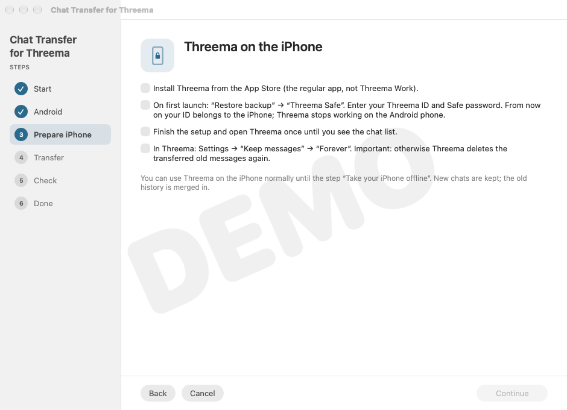

<!-- screenshot planned: ../../images/device/en/threema-ios-restore-safe.png -->

<!-- screenshot planned: ../../images/device/en/threema-ios-keep-messages.png -->

<!-- screenshot planned: ../../images/device/en/threema-ios-add-contact.png -->

**iPhone settings.** Tick each item:

1. iOS updates off: Settings → General → Software Update → Automatic Updates → all off †. Do not install any update
   until the end.
2. App updates off: Settings → Apps → App Store → App Updates off †.
3. Turn off Find My, preferably at home: first Settings → Face ID & Passcode → "Stolen Device Protection" off (if on;
   away from home the iPhone delays this by one hour). Then Settings → [your name] → Find My → "Find My iPhone" off
   (Apple Account password needed) †.
4. Battery at least 50 % or charging.

At the end the app tells you when to turn everything back on.

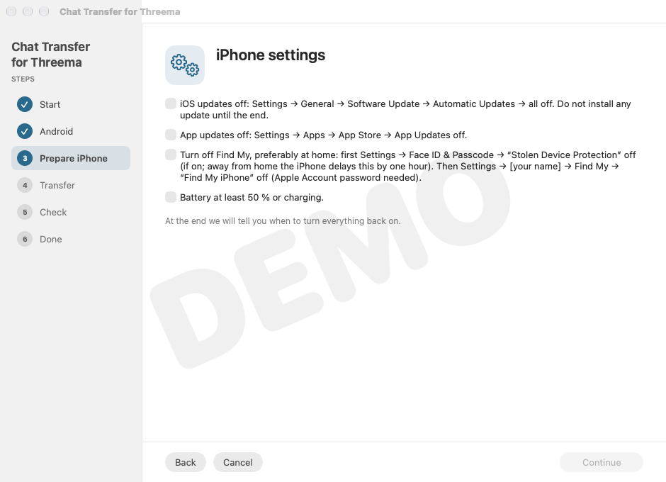

<!-- screenshot planned: ../../images/device/en/iphone-software-update-automatic.png -->

<!-- screenshot planned: ../../images/device/en/iphone-app-store-app-updates.png -->

<!-- screenshot planned: ../../images/device/en/iphone-stolen-device-protection.png -->

<!-- screenshot planned: ../../images/device/en/iphone-find-my.png -->

**Apple safety net (required).** If something goes wrong, you need a backup that Apple itself can restore. Chat Transfer for Threema
only needs it in an emergency. Choose one:

- **iCloud Backup (easy, no extra password):** Settings → [your name] → iCloud → iCloud Backup → "Back Up Now" †. Wait
  until it says "Last backup: just now". Your iCloud storage needs enough space for this.
- **Backup on this Mac (no iCloud storage needed):** Finder → your iPhone → General → "Encrypt local backup" → "Back Up
  Now". If the box was still unticked, you set a new password for iPhone backups on the Mac there: write it down, the
  app asks for it next. If it was already ticked, your existing password applies. Then "Manage Backups …" →
  right-click the new backup → "Archive". The app tells you how much space this needs.

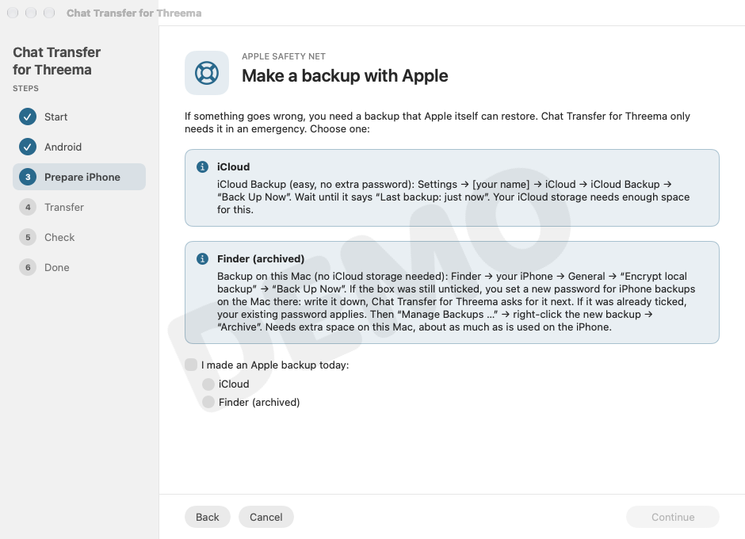

<!-- screenshot planned: ../../images/device/en/iphone-icloud-backup-now.png -->

<!-- screenshot planned: ../../images/device/en/mac-finder-encrypt-local-backup.png -->

<!-- screenshot planned: ../../images/device/en/mac-finder-archive-backup.png -->

**Password for iPhone backups.** Chat Transfer for Threema needs encrypted iPhone backups, because only those contain all data. This
is the password for iPhone backups on the Mac: **not** your iPhone passcode, **not** your Apple Account password and
**nothing** from iCloud. In detail, including where you might find it:
[The iPhone backup password](#the-iphone-backup-password).

- If it is still **off** ("Your iPhone has no backup password yet"), Chat Transfer for Threema creates a password for you (six
  groups of four characters); exactly this one protects your backups from now on. Write it down and keep it safe: you need it whenever you restore from a Mac backup later. By default it is also saved in this Mac's
  keychain. To confirm, you type its last four characters; then you enter your passcode on the iPhone. Nothing on the
  iPhone is deleted, and the setting stays on afterwards.

  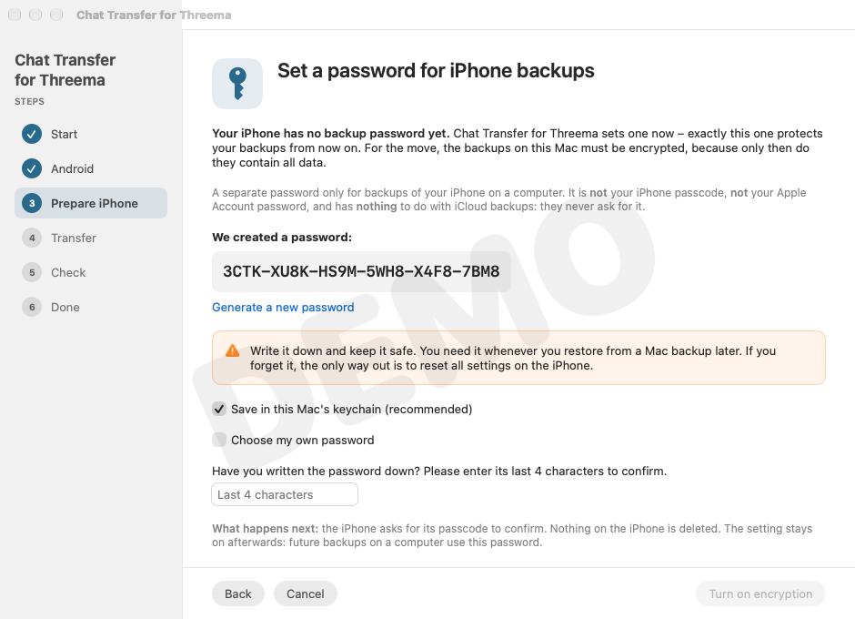

- If it is already **on**, the iPhone encrypts every backup with its stored password; a new or made-up password does
  not work. The app asks: "Do you know this password?" If you do, enter it; the app checks it right after the first
  backup, and if it is wrong you type it again without a new backup. If you do not, the app shows where to look and, as
  the last way, Apple's "Reset All Settings"; after **Check again** it then sets a new password.
- If you made the Finder backup in the step before and newly ticked "Encrypt local backup", Finder turned encryption
  on with your own password. Chat Transfer for Threema reads the state again after the safety net and asks for exactly that password.
  If a password does not match, the app asks again every time; it never reuses a saved password that did not match.

  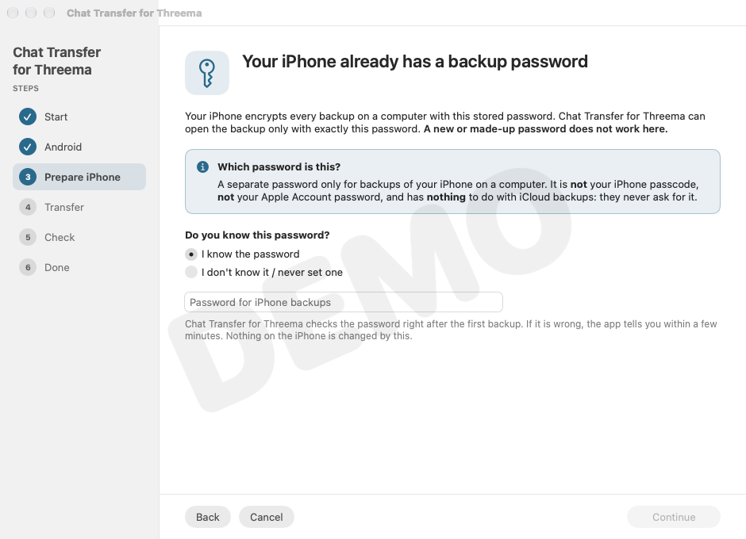

### Phase "Transfer" (the time window)

**Take your iPhone offline.** From this step until the end your iPhone stays offline and unused (about 30 to 60
minutes). Photos, messages and settings from this time would otherwise be deleted.

1. Close Threema: swipe up from the bottom edge and swipe Threema away.
2. If you have an Apple Watch: turn the Watch off. Turn Bluetooth off in Settings → Bluetooth (not just in Control
   Center).
3. Airplane mode on. Check in Control Center that Wi-Fi is off too.
4. Leave the iPhone unlocked and connected.

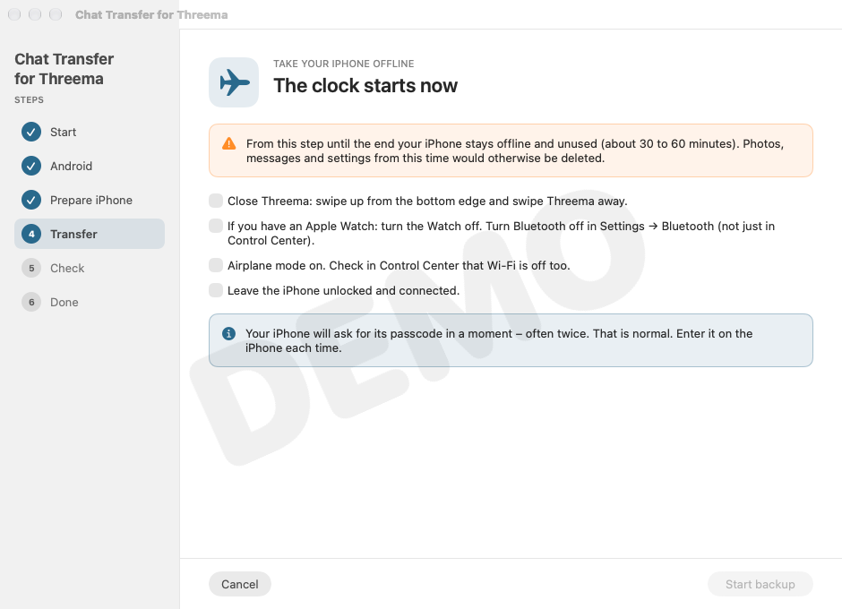

<!-- screenshot planned: ../../images/device/en/iphone-app-switcher-close-threema.png -->

<!-- screenshot planned: ../../images/device/en/iphone-settings-bluetooth.png -->

<!-- screenshot planned: ../../images/device/en/iphone-control-center-airplane-wifi-off.png -->

**Backing up your iPhone.** Keep the cable connected. Your iPhone will ask for its passcode in a moment – often
twice. That is normal; enter it each time. If the backup stops after a few seconds, Chat Transfer for Threema restarts it automatically; that is normal. Afterwards Chat Transfer for Threema checks: password
correct, airplane mode was on, Threema set up, "Keep messages: Forever", Threema version supported, same Threema ID
as in the Android backup, photos on the iPhone within the limit.

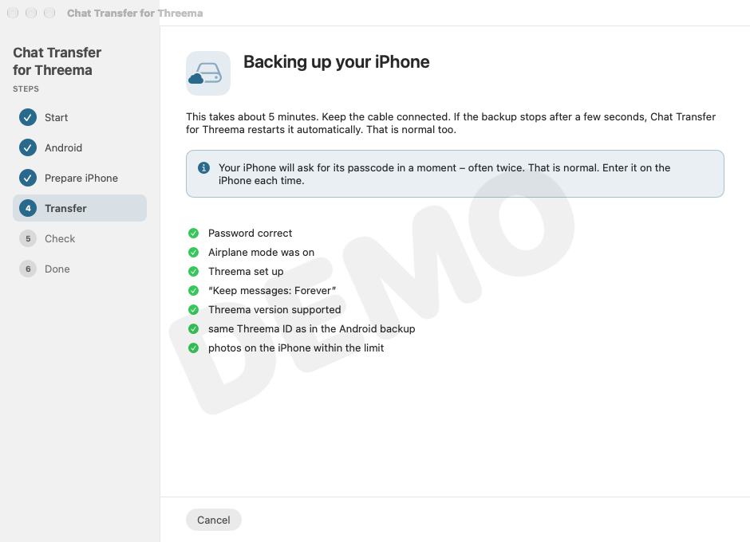

If airplane mode was not on during the backup, Chat Transfer for Threema asks you to turn it on and makes a new backup.

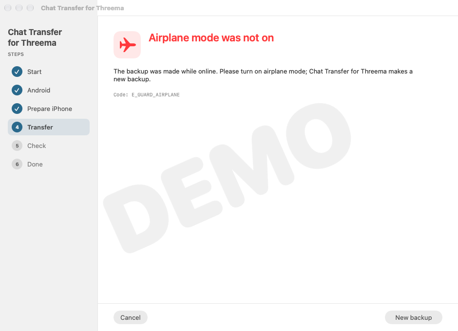

**Preparing the transfer.** Chat Transfer for Threema adds your history to a copy of your iPhone data and double-checks everything.
The iPhone is not changed. A countdown shows by when the transfer must start: at most 60 minutes after the backup.

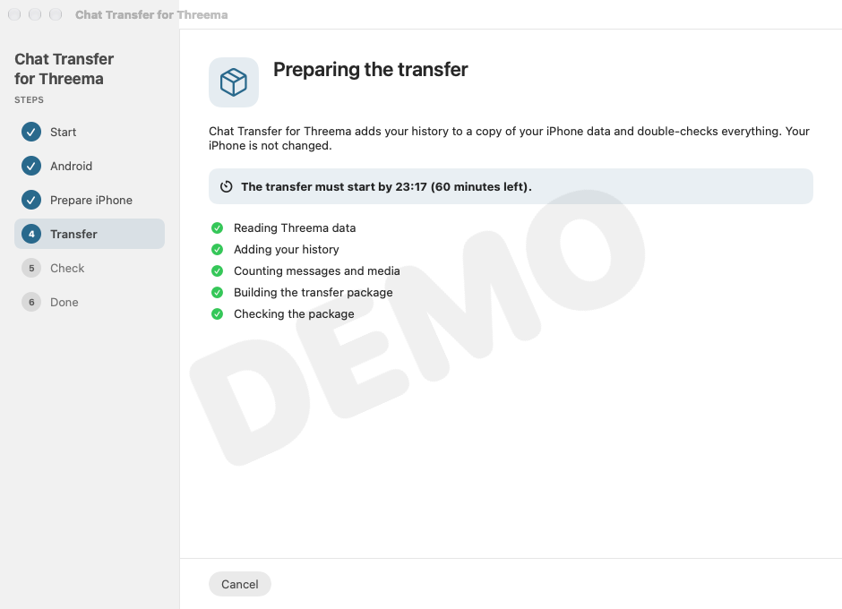

If the time runs out, Chat Transfer for Threema simply makes a new backup and prepares again. The iPhone stays in airplane mode.

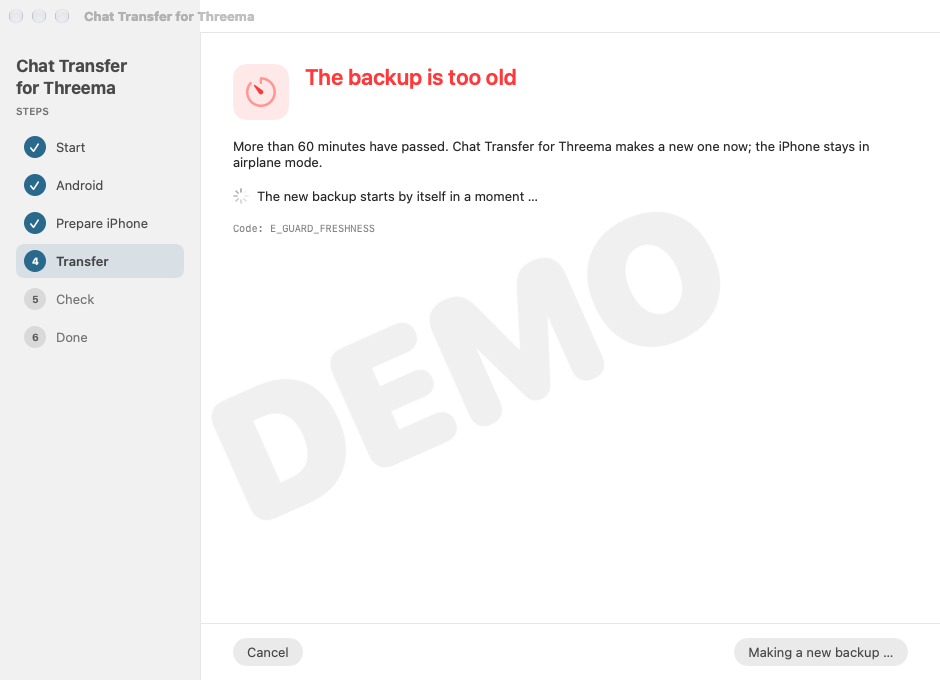

**Ready to transfer.** The screen tells you exactly what will happen, for example "12 345 messages and 1 234 media
(6.4 GB)". If your Android history is already on the iPhone, it says: "Your Android history is already on the
iPhone – nothing new will be added." It also explains what happens to the iPhone: settings, notifications, photos on
the iPhone, SMS/iMessage, call history, Wallet passes and keyboard come from the backup made a few minutes ago, so
they stay practically as they are. The iPhone is not erased and not reset. Afterwards you only redo two things: sign
in to your Apple Account again and add your Apple Pay cards again. Tick both boxes (Apple backup made today; Apple Account password at hand) and click
**Transfer now**. "Cancel" is still possible here, and nothing on the iPhone is changed.

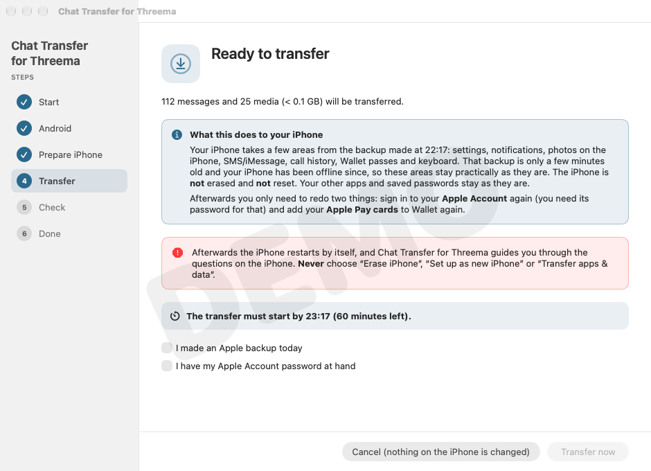

Right before sending, Chat Transfer for Threema checks once more. Two typical stops:

- Photos on the iPhone changed since the backup: Chat Transfer for Threema makes a new backup so that no photo is deleted. Please do
  not use the iPhone.

  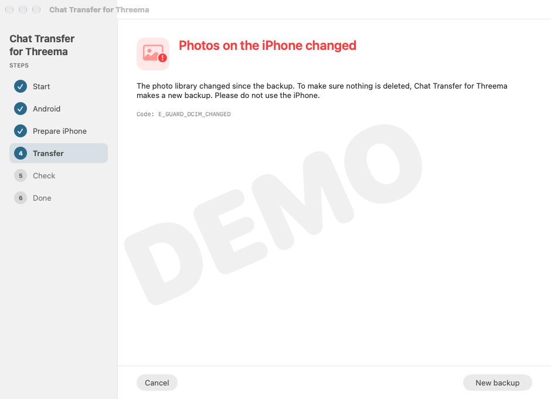

- Find My is still on: turn it off (step "iPhone settings", item 3) and try again. Nothing on the iPhone was changed.

  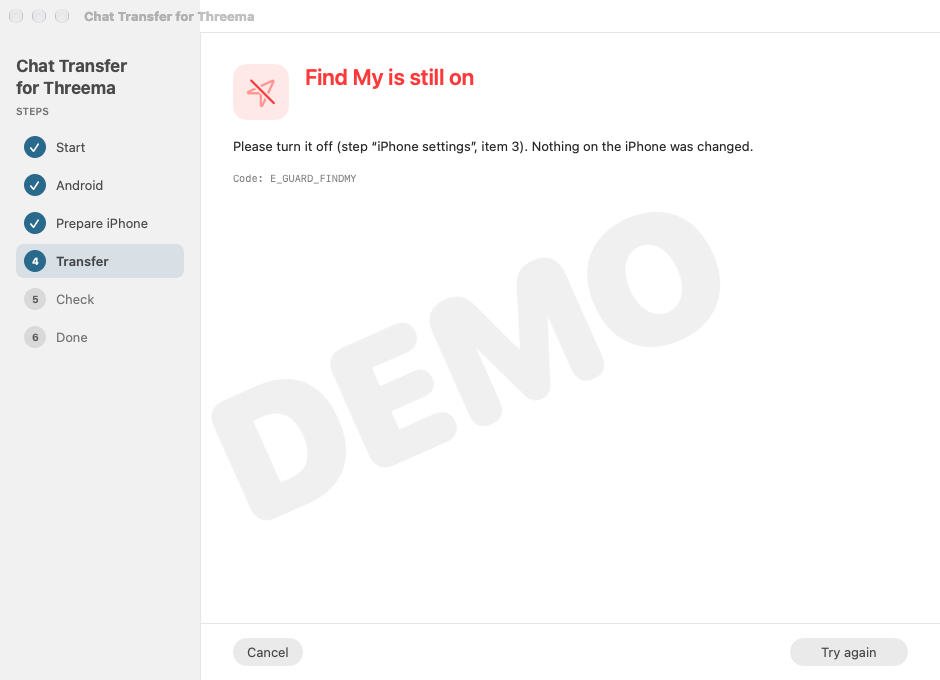

**Transfer in progress. Do not disconnect the cable.** The iPhone now shows "Restore in progress" †. Enter the
passcode if asked. Do not touch anything else and do not close the Mac's lid. "Cancel" and quitting the app are
locked during this step. At the end the iPhone restarts by itself and the connection to the Mac drops briefly. That
is normal.

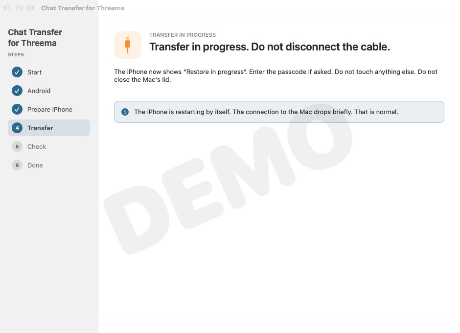

<!-- screenshot planned: ../../images/device/en/iphone-restore-in-progress.png -->

### Phase "Check"

**On the iPhone after the restart.** You will see, one after another †:

1. "Swipe up to upgrade" → swipe up, enter your passcode.
2. "Restore completed" → "Continue".
3. Apple Account → enter your password. If the iPhone cannot continue without internet, choose "Later". Keep airplane
   mode on.
4. Apple Pay → "Set up later in Wallet".
5. Home screen.

**Never** tap "Erase iPhone", "Set up as new iPhone" or "Transfer apps & data". If the iPhone asks for language or
country, do not tap anything and choose the second answer in the app's question.

Then answer the app's question: which questions did your iPhone ask after the restart? *Only "Restore Completed",
Apple Account and/or Apple Pay* · *Also language, country or "Apps & data"* · *No questions at all*. The first and
the third answer continue with the Threema check. The second answer means the iPhone sits in Setup Assistant: then
there is no Threema check and no control backup; the app shows the way back with your Apple backup right away (R4,
chapter 6).

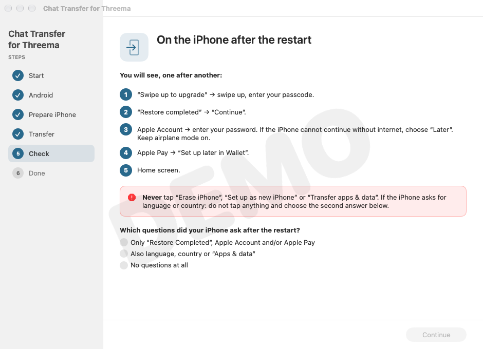

<!-- screenshot planned: ../../images/device/en/iphone-swipe-up-to-upgrade.png -->

<!-- screenshot planned: ../../images/device/en/iphone-restore-completed.png -->

<!-- screenshot planned: ../../images/device/en/iphone-apple-account-signin.png -->

<!-- screenshot planned: ../../images/device/en/iphone-apple-pay-later.png -->

Do **not** tap these screens:

<!-- screenshot planned: ../../images/device/en/iphone-danger-transfer-apps-data.png -->

<!-- screenshot planned: ../../images/device/en/iphone-danger-erase.png -->

**Check Threema.** Open Threema on the iPhone; airplane mode stays on. Are your old chats there? Can you scroll up
through old messages? Are pictures shown? The largest chat takes a few seconds the first time. Close Threema again
afterwards. If Threema asks to "repair the database" or "delete data": do not tap anything, close Threema and choose
"Problem".

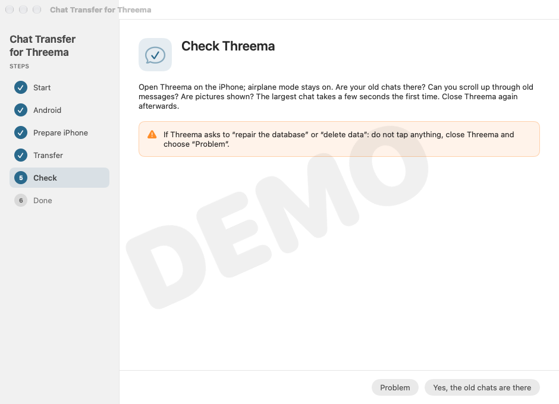

**Control backup.** Chat Transfer for Threema makes a second backup and compares it with the first. This shows whether anything other
than Threema changed. Enter your passcode on the iPhone if asked.

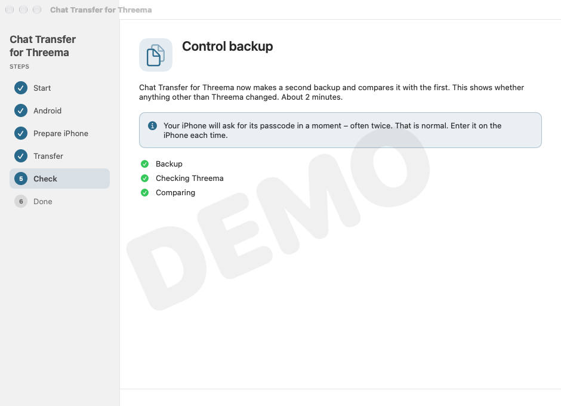

### Phase "Done"

**Done!** Your Threema history is on the iPhone, and your other data is as before. Notes below the green result are
known, harmless effects, for example: add your Apple Pay cards again; your calendar syncs again once the internet is
back on; clock wallpaper caches were rebuilt; the Shortcuts catalogue was rebuilt (your shortcuts are there).

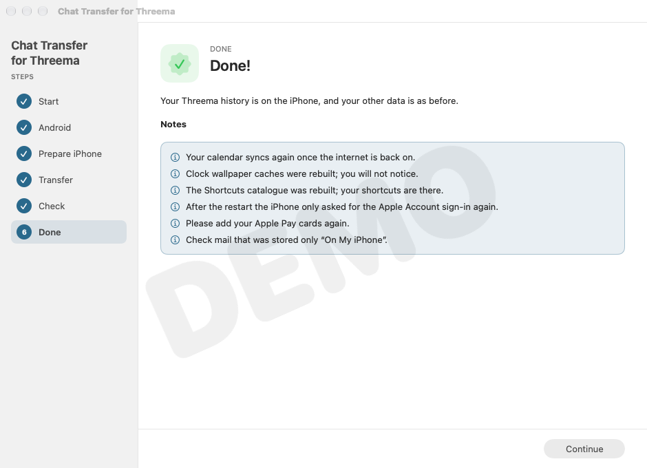

**Turn things back on and clean up.** See chapter 5.

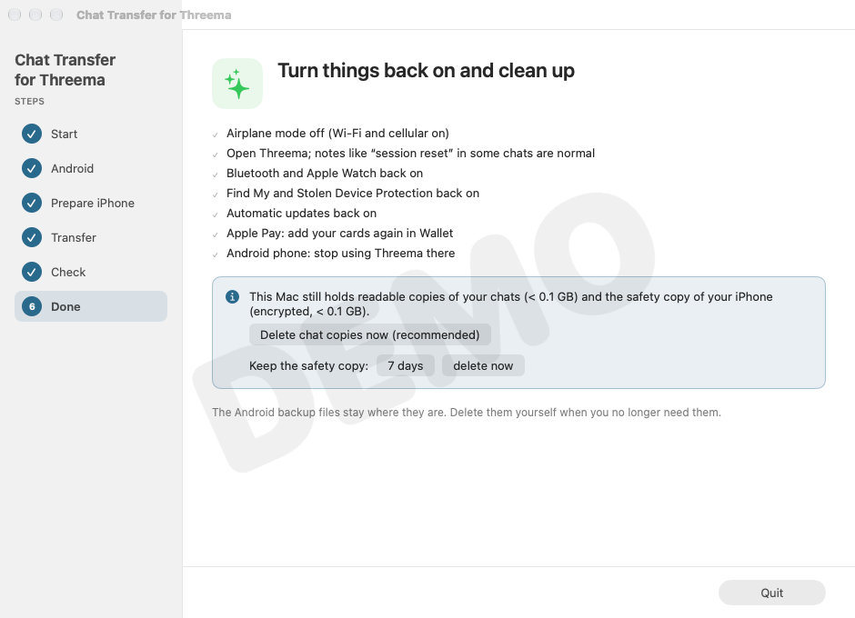

## 5. After the move

Turn everything back on, in this order:

1. Airplane mode off (Wi-Fi and cellular on).
2. Open Threema. Notes like "session reset" in some chats are normal: the encryption sessions are renegotiated. No
   history is lost by this.
3. Bluetooth and Apple Watch back on.
4. Find My and Stolen Device Protection back on.
5. Automatic updates back on.
6. Apple Pay: add your cards again in Wallet.
7. Android phone: stop using Threema there.

**Clean up on the Mac.** The Mac still holds readable copies of your chats and the safety copy of your iPhone
(encrypted). Click "Delete chat copies now" (recommended). Keep the safety copy for 7 days or delete it now; after
7 days the app suggests deleting it again. The Android backup files stay where they are; delete them yourself when you
no longer need them.

**The iPhone backup password stays on.** Chat Transfer for Threema does not turn off the encryption of iPhone backups at the end.
Encrypted local backups are better. Keep the password.

## 6. If something goes wrong

**Before "Transfer now", nothing on the iPhone has been changed** (only the backup encryption, if you turned it on,
and it stays on). Every stop before that point tells you what to do: fix the cause and try again, or quit.

**If you stop before the end** (cancel, quit, a stop without a way on, waiting for a new version), turn back on on the
iPhone what you switched off for the move: airplane mode off, Bluetooth and Apple Watch on, Find My and Stolen Device
Protection on, automatic updates on. If you want to continue later, keep iOS updates off until then. The app shows
this list at every such stop.

One stop that often has a simple cause: the Android backup belongs to a different Threema ID than Threema on the
iPhone. Check that you chose the right file.

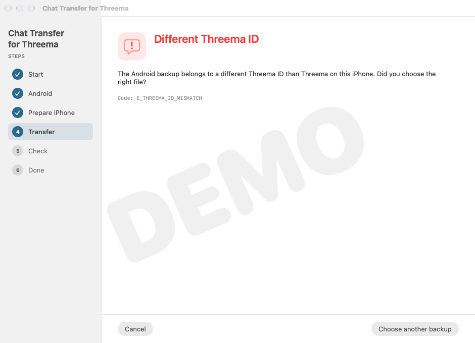

A related stop: **Threema ID on the iPhone not readable.** The app reads the iPhone's Threema ID from your groups in
Threema. If you are not in any group, it cannot compare and stops; nothing on the iPhone was changed. Then create a
group with only yourself in it (a note group) in Threema on the iPhone †, close Threema again (airplane mode stays
on) and click "New backup".

**After the transfer**, the control backup decides. If it finds anything other than the expected changes, the app
stops on a red screen. First, always:

- Keep airplane mode **on** and Wi-Fi off.
- Do not charge the iPhone on Wi-Fi tonight; otherwise an iCloud backup overwrites your good iCloud backup.
- Do not change anything on the iPhone.

Then one of four ways applies, and the app shows which one:

**Only Threema did not take over the history (R1).** Your iPhone is fine. Chat Transfer for Threema can reset Threema to how it was
before the transfer, up to 6 hours after the first backup. Settings, photos on the iPhone and keyboard also go back to
that point. Click "Reset Threema". The app also shows this way when you chose "Problem" at "Check Threema" and every
other check is green. Afterwards you check Threema once more: it should now be as it was before the transfer,
without the history from the Android backup. If the app refuses the reset (more than 6 hours, or it was already
reset once), the ways of R2 remain.

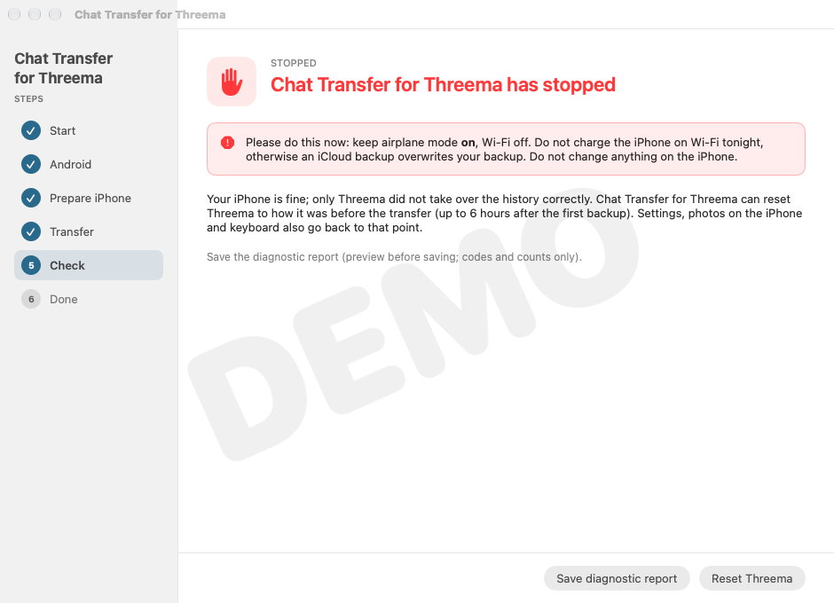

**Something other than Threema changed (R2).** The app names the areas. The safe way back is today's Apple backup
(below). You can also leave the iPhone as it is and fix these areas by hand.

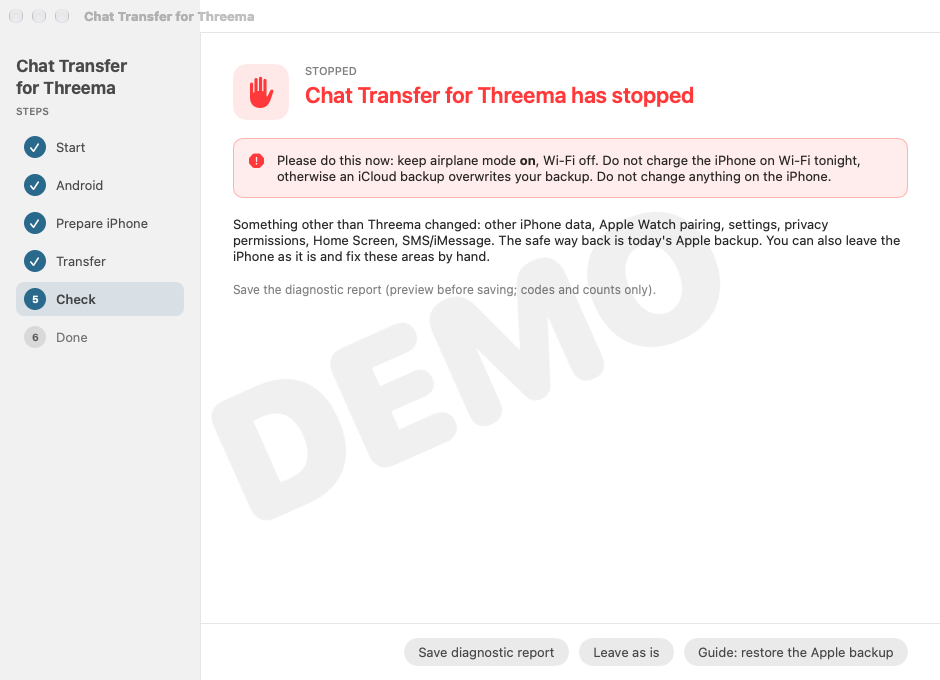

**Some saved sign-ins are missing (R2k).** Affected apps will ask you to sign in next time. Only your Apple backup
brings them all back.

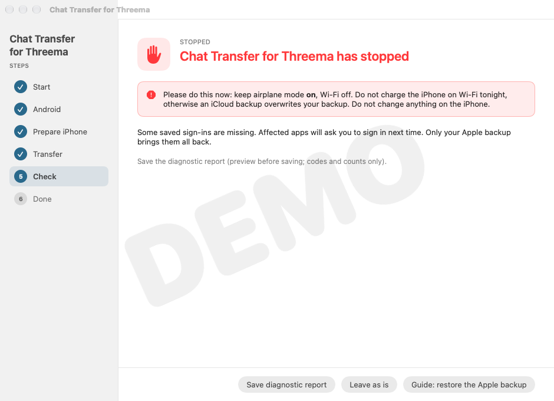

**The iPhone wants to be set up again (R4).** Do not erase anything and do not set it up as new. Follow the guide for
your Apple backup. The iPhone already sits in Setup Assistant; the guide starts there (no erasing).

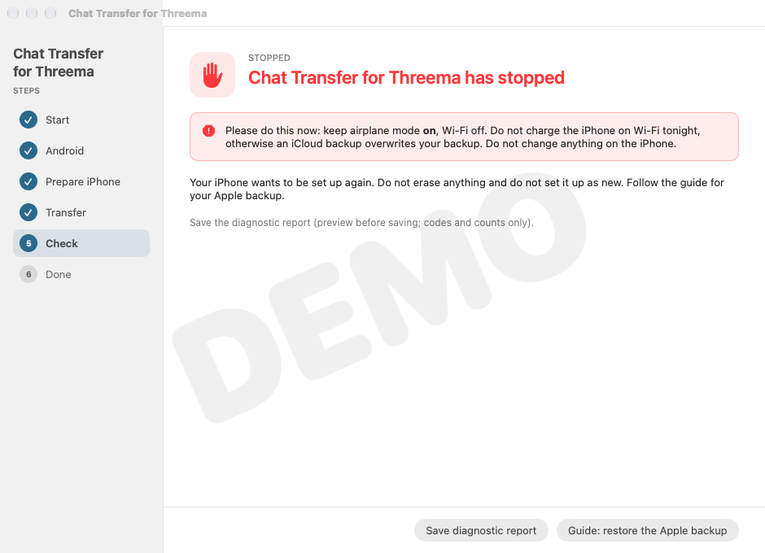

### Restoring your Apple backup

The app shows the guide that matches the backup you made in the step "Apple safety net":

- **iCloud:**
  1. Check first: Settings → [your name] → iCloud → iCloud Backup †. It must show a backup from today made before the
     transfer (the app names the time). If there is no such backup: **do not erase anything**, choose "Leave as is".
  2. Only if that backup is there: Settings → General → Transfer or Reset iPhone → "Erase All Content and Settings" †.
     Only here is erasing right: an iCloud backup can only be restored in Setup Assistant after erasing.
  3. In Setup Assistant, connect to Wi-Fi (this needs internet), choose "From iCloud Backup" and pick today's backup
     made before the transfer.

  If the iPhone already sits in Setup Assistant (R4), steps 1 and 2 do not apply: choose language and country,
  connect to Wi-Fi, and at "Transfer Your Apps & Data" choose "From iCloud Backup" †.
- **Finder:** connect the iPhone → Finder → your iPhone → "Restore Backup …" → choose today's **archived** backup
  (Finder may suggest another one) → enter the password. If the iPhone sits in Setup Assistant (R4), Finder shows
  "Welcome to Your New iPhone": choose "Restore from this backup" there †.

Afterwards: sign in to your Apple Account, add Apple Pay cards again; some banking or authenticator apps may need to
be set up again. Threema is back to its state before the move; if it asks for your ID, restore it with Threema Safe.
Then turn back on what you switched off for the move: airplane mode off, Bluetooth and Apple Watch, Find My and Stolen
Device Protection, automatic updates.

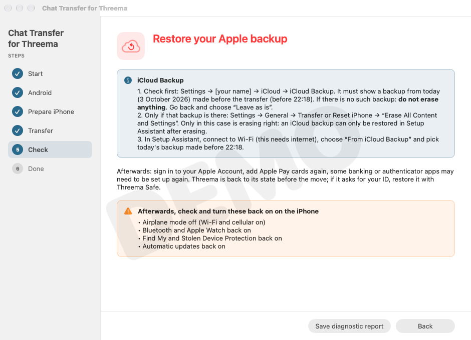

### If the app or the Mac stopped

Start Chat Transfer for Threema again. It continues at the right place. If the transfer was already sent to the iPhone, it always
continues with the check, never with "start over".

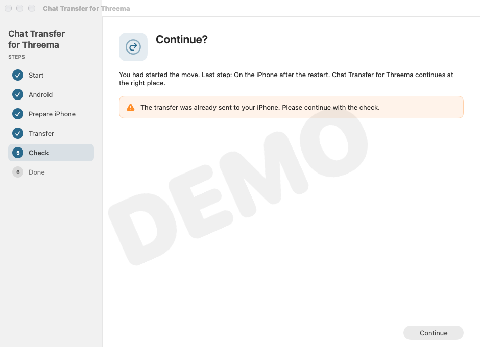

### Diagnostic report

On every red screen you can save a diagnostic report. You see a preview before saving. It contains codes, counts,
version numbers and the result of the checks; no names, no messages, no Threema IDs, no phone numbers. Attach it to a
bug report (chapter 10). Nothing is uploaded automatically.

## 7. Frequently asked questions

**Why airplane mode?** The restore puts some areas of the iPhone back to the moment of the backup. Anything that
arrives in between would be lost: photos, SMS, and Threema messages too. In airplane mode, new Threema messages wait
on the server and arrive after you turn airplane mode off. Airplane mode also stops app and iOS updates during the
transfer.

**Why an iPhone backup password?** Only encrypted iPhone backups contain all data, for example Wi-Fi and Health data
and saved sign-ins of some apps. An unencrypted backup would leave gaps.

**I only ever made iCloud backups and never set a password. Which password does the app want?** The password for
iPhone backups on the Mac. It is not your iPhone passcode, not your Apple Account password, and has nothing to do with
iCloud. If the app asks for it, it is already turned on for your iPhone, often for years and perhaps carried over from
an earlier iPhone. A new made-up password does not work then: the backup opens only with exactly the stored one. Choose
"I don't know it / never set one"; the app shows where to look and, as the last way, Apple's "Reset All Settings". If
it is off, the app sets one up for you. More: [The iPhone backup password](#the-iphone-backup-password).

**What happens with my data?** Everything stays on your Mac. Chat Transfer for Threema opens no internet connection; this is enforced
technically. Readable copies of your chats exist on the Mac until you clean up at the end. See chapter 8.

**Why this warning when opening the app?** Chat Transfer for Threema is not registered with Apple (paid developer programme), so macOS
cannot confirm the developer. See chapter 3. The source code is public and every release has a checksum.

**My iOS version is not listed.** Chat Transfer for Threema only transfers on iOS versions it has tested on a device, because iOS
changes how restores work from time to time. You can already prepare the Android part; the session waits. Do not
install another iOS update in the meantime. A newer Chat Transfer for Threema version usually follows within two weeks.

**Can I keep using Threema on Android?** No. As soon as you restore your ID with Threema Safe on the iPhone, Threema on
the Android phone stops working. That is how Threema works, independent of Chat Transfer for Threema.

**Can I do this twice?** There is no need to. If you run it again, the import skips messages that are already on
the iPhone. But every run is another restore of the iPhone, so start a second run only if Chat Transfer for Threema tells you to.

**Is this allowed?** Chat Transfer for Threema only works with your own backups on your own devices. It is not affiliated with
Threema AG or Apple Inc.

## 8. Privacy

- **Offline.** The app opens no network connection. The engine blocks every network socket except the local USB
  connection to the iPhone, and additionally runs under a macOS sandbox profile without network access. No telemetry,
  no crash reporter, no update check. "Check for updates" only opens the release page in your browser.
- **What is on the Mac during the move.** A session folder in
  `~/Library/Application Support/Chat Transfer for Threema/sessions/`: the prepared Android history (readable), the iPhone backups
  (encrypted), working copies and reports with counts only. The folder is only accessible to your user, excluded from
  Time Machine and not indexed by Spotlight.
- **Passwords.** The Android backup password and an iPhone backup password you type are kept only in memory. A
  password generated by Chat Transfer for Threema is stored in your keychain if you agree ("Chat Transfer for Threema – Backup-Passwort").
- **Clean up.** At the end, "Delete chat copies now" removes the readable copies. The safety copy of your iPhone can
  be kept for 7 days.
- **Diagnostic report.** Only on click, with a preview, saved as a file. Codes, counts and versions only. Never
  uploaded.
- **On screen.** The app never shows the device name or serial numbers of your iPhone; Threema IDs appear only in the
  list of people you need to add as contacts.

More: [../../PRIVACY.md](../../PRIVACY.md).

## 9. Uninstalling

1. Quit Chat Transfer for Threema and drag it from "Applications" to the Trash.
2. Delete the folder `~/Library/Application Support/Chat Transfer for Threema` (in Finder: Go → Go to Folder …). It contains your
   session folders; delete it only when you no longer need the safety copy.
3. Open Keychain Access and delete the item "Chat Transfer for Threema – Backup-Passwort" if you no longer need it. Keep the password
   itself written down: it still protects your iPhone backups.
4. Optional: if you no longer want encrypted iPhone backups, turn off "Encrypt local backup" in Finder. This needs the
   password.

## 10. For advanced users

**Check the download.** Each release has a `SHA256SUMS` file. In Terminal:

```
cd ~/Downloads
shasum -a 256 -c SHA256SUMS --ignore-missing
```

The 0.9.x betas are built locally and only come with these checksums. A minisign signature (`SHA256SUMS.minisig`) and a
build provenance attestation from GitHub Actions (`gh attestation verify …`) are planned from version 1.0.

**Build from source.** Requirements: Mac with Apple silicon, Xcode, Python 3.13. Then `git clone`, `make app`
(see `README.md` in the repository). The app built this way is signed ad-hoc on your Mac.

**Report a bug.** Open an issue with the template "Bug report" and attach the diagnostic report. Never attach
backups, chat screenshots, Threema IDs or device names. Security problems: see `SECURITY.md`.

**How it works.** Restore mechanism: [../../RESTORE-MECHANISM.md](../../RESTORE-MECHANISM.md) · security model:
[../../SECURITY-MODEL.md](../../SECURITY-MODEL.md) · which iOS versions are supported and why:
[../../COMPAT-POLICY.md](../../COMPAT-POLICY.md).

---

Chat Transfer for Threema is an independent open-source project and is not affiliated with, endorsed or reviewed by Threema AG or
Apple Inc. Threema is a trademark of Threema AG. Apple, iPhone, Finder, iCloud and Apple Pay are trademarks of Apple
Inc. These names are used only to describe compatibility. Use at your own risk, without warranty (AGPL-3.0 §§ 15–16).
